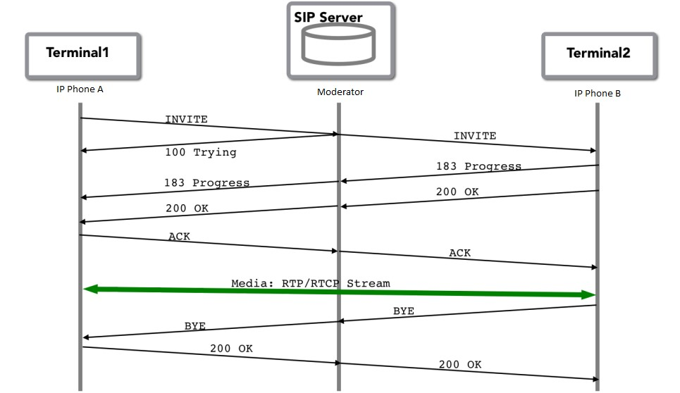

# A Sip of SIP

All existing collaboration engineers out there must have known/worked on the SIP protocol either directly or in-directly, and they understand the importance of SIP in current and next generation VoIP networks. Collaboration engineers need to understand it more than ever as SIP is becoming an integral part of the VoIP network as we are unfolding towards the future. As I discussed with my colleagues and fellow engineers, I realized how much we have struggled and are struggling to understand SIP in more detail. This blog will not make you an expert in SIP, but it’s an attempt to make you familiar with it. Hope you enjoy it.

SIP is known as Session Initiation Protocol. The base RFC for SIP is RFC3561. It’s an application-level signaling protocol used to create, modify, or terminate VoIP multimedia session. It’s independent of lower level protocols like UDP/TCP/IP/IPv6, etc. It’s a plain text-based protocol with a response/request-based process very similar to HTTP. SIP is used under VoIP in conjunction with SDP (Session Description Protocol). Base RFC for SDP is 4566. SDP is an independent protocol but used for exchanging and negotiating media/codec capabilities between two endpoints during a call SETUP process. SIP uses port number 5060, but it can be changed if required.

SIP works on a client/server architecture. We have a client who requests and there is a server which will reply with a response to a request.

There are different roles of devices during a SIP communication as mentioned below:

- User-Agent: This is a part of every SIP station and further categorized into two roles
- UAC (User Agent Client): It initiates a SIP request.
- UAS (User Agent Server): it receives a request and provides a response as per the accept/reject or redirect action on the received request.
- Redirect Server: It redirects the request to the appropriate party for request fulfillment.
- Proxy Server: It acts on behalf of the requester and continues the communication/session with the other end party.
- Registrar Server: An endpoint registers on the SIP registrar server so that if there was an incoming request for the endpoint, the server can communicate it to the endpoint. It also acts as a navigator for SIP endpoint while initiating a SIP request.

## Sample SIP Invite:

INVITE sips:Chandan @ CLN.com SIP/2.0

Via: SIP/2.0/TLS admin.cisco.com:5061;branch = z9hG4bK74bf9

Max-Forwards: 70

From: Admin <sips:Admin @ Cisco.com>;tag = 1234567

To: Chandan <sips:Chandan @ CLN.com>

Call-ID: 12345601@192.168.2.1

CSeq: 1 INVITE

Contact: <sips:Admin @ admin.cisco.com>

Allow: INVITE, ACK, CANCEL, OPTIONS, BYE, REFER, NOTIFY

Supported: replaces

Content-Type: application/sdp

## SDP Message Body:

v = 0

o = Alice 2890844526 2890844526 IN IP4 client.ANC.com

s = Session SDP

c = IN IP4 admin.cisco.com

t = 3034423619 0

m = audio 49170 RTP/AVP 0

a = rtpmap:0 PCMU/8000

## SIP Message Headers:

There is a required field in the header of every SIP request:

To/From/Cseq/Call-ID/Max-forwards/Via

To: Logical destination of the receiving party (but maybe an actual address or it can be of proxy server address)

From: Logical address for the initiator of the request

Call-ID: This will always be globally unique and used to identify the ongoing call session or conversation

Cseq: It can be a value but totally random. If it’s X in the first transaction/invite then it will increment by 1 in every transaction, like X+1.

Max-forward: This is the same as TTL in the data domain. If max-forward is 0, it will reply as 483 and do not forward further. It’s a loop avoidance mechanism within the SIP protocol.

Via: This field basically adds the proxy information (address & port) by proxy and forwards the request, while processing response proxy removes it and sends a response to the end station.

Contact: Informs where to send the future/subsequent request.

SIP URI (Uniform Resource Identifier): URI is like URL in SIP, for eg: chandan @ cln.com. It means Chandan can be reached via CLN address, or if you want to reach Chandan, go to cln.com

## SIP Call Flow:

Let’s take a few scenarios for SIP protocol used in VoIP network:

Scenario A:

    IP Phone A <----------SIP----------> IP PBX (SIP registrar server) <-------------SIP--------------> IP Phone B

Scenario B:

    IP Phone A <----------SIP----------> IP PBX (SIP registrar server) <-------------SIP or H.323--------------> SBC (CUBE) <--------------SIP Trunk ------------à PSTN

There can be multiple scenarios based on configuration and requirement of deployment.

- Member A tries to make a call towards Member B.
- First Member A (Caller) sends an invite message to the Moderator for initiating a call.
- Moderator sends an invite to the Member B (Called Party).
- Moderator sends a 100 trying response to Member A, indicating it is trying to reach Member B.
- Moderator receives a 180 ringing response from Member B.
- Moderator send a 180 ringing to Member A
- Member B answers the call and sends a 200 ok message to the Moderator.
- Moderator sends a 200 ok message to Member A, indicating Member B answered the call.
- Member A acknowledges it and sends an ACK message in response.
- Moderator sends an ACK message to Member B phone.
- Now both parties can talk on the call.
- Member A hangs up the call.
- Member A sends a BYE message to Moderator.
- Moderator sends BYE to member B phone.
- Member B sends a 200 ok message to Moderator.
- Moderator sends 200 ok message back to Member A confirming call disconnect.

++ ACK messages are only seen as a response to 200 messages in invite request.

## Different SIP Requests and Responses:

There are a lot of SIP requests, so I am only going to cover a few of them.

Request:

    REGISTER: This request is sent for registering their location and updating their address/location in server address book.
    INVITE: This is a request to proceed with initiating a call setup.
    ACK: Confirm the receiving of final response on behalf of initial invite request.
    BYE: The initiation of termination of the call or session.
    CANCEL: Request for canceling the current pending request.
    OPTIONS: Querying the capabilities of current endpoints also used for keepalive process.

Response:

    1XX (Provisional): Provisional response to the requester and confirms that the request is valid and getting processed.
    2XX (Success): Successful completion of the current request.
    3XX (Redirection): Used to redirect the request for further processing/completion.
    4XX (Client Error): Request cannot be fulfilled at the server end.
    5XX (Server Error): Request is valid but the server is unable to fulfill it, at the moment.
    6XX (Global Failure): Request cannot be fulfilled by any server.

## SDP Attributes Description:

V = (protocol version number, currently only 0)

O = (originator and session identifier: username, id, version number, network address)

S = session name: mandatory with at least one UTF-8-encoded character)

C = (connection information—not required if included in all media)

T = (time the session is active)

M = (media name and transport address)

A = (zero or more media attribute lines — overriding the Session attribute lines)

There are lots of things to discuss about SIP, and I will try to discuss them in sections over upcoming posts in future. Thanks.

###### This was pulled from [Cisco Learning Network](https://learningnetwork.cisco.com/s/blogs/a0D3i000002SKPGEA4/a-sip-of-sip)