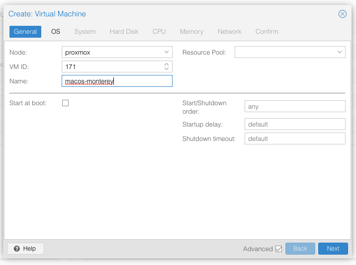
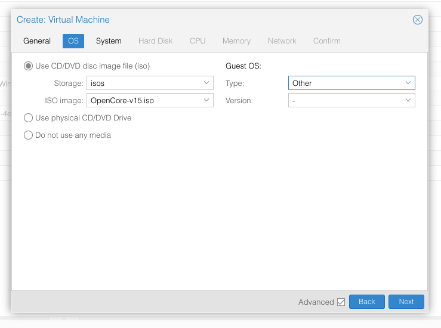
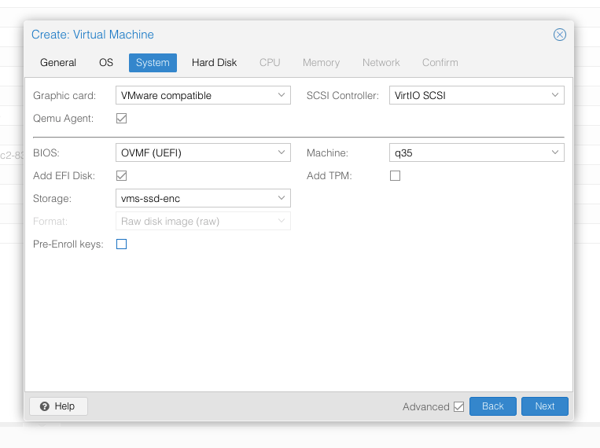
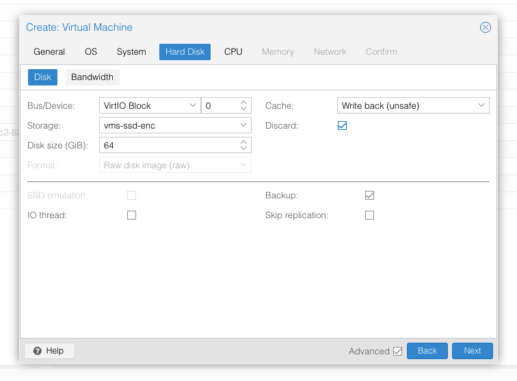

# Mac OS as a Virtual Machine

OSK Key: `ourhardworkbythesewordsguardedpleasedontsteal(c)AppleComputerInc`

ref: 
- https://www.nicksherlock.com/2021/10/installing-macos-12-monterey-on-proxmox-7/
- https://forum.proxmox.com/threads/mini-howto-running-mac-os-x-10-9-under-proxmox-3-3.19722/page-4
- https://github.com/thenickdude/KVM-Opencore/releases
- https://github.com/thenickdude/OSX-KVM

Requires `make`, `unzip`, `qemu-utils` (not required on proxmox)

## Set-up

- Install any requirements if not already installed
  - You can check if items are installed with `which`
- Download as a zip file [this repository](https://github.com/thenickdude/OSX-KVM)
- Change directories (`cd`) into `OSX-KVM-master/scripts/monterey`
- Run the following command: `make Monterey-recovery.img`
  - Wait while make does it's thing, time will varry as it will download macos Monterey
- Upload `Monterey-recovery.img` to proxmox iso repository 
  - via web ui or (usually) `/var/lib/vz/template/iso` 

## Create the Virtual Machine: 

- From the Proxmox web UI, create the new VM as follows:
  - Be sure to keep note of the VM's ID! 
- Click Create VM in top right of Proxmox Web UI
  - 
- Use the OpenCore iso downloaded earlier for the base image. Set OS type to "other"
  - 
- Set graphics to “VMWare Compatible”, set BIOS to OVMF (UEFI), set Machine to Q35, tick QEMU Agent, tick Add EFI Disk and pick storage for it. You must untick “pre-enroll keys”
  - 
- Set the size of the hard disk (64GB or greater, 32GB is too small). Attach it to virtio0. Enable discard to support TRIM.
  - 
- Choose VirtIO (paravirtualized) for the network mode
- Create but DO NOT start the VM *yet*.

## Virtual Machine Configuration:

- SSH into Proxmox server
- Edit VM's configuration file
  - located at `/etc/pve/qemu-server/YOUR-VM-ID-HERE.conf`
- Add the following line to the `VMID.conf` file:
  - `args: -device isa-applesmc,osk="ourhardworkbythesewordsguardedpleasedontsteal(c)AppleComputerInc" -smbios type=2 -device usb-kbd,bus=ehci.0,port=2 -global nec-usb-xhci.msi=off -global ICH9-LPC.acpi-pci-hotplug-with-bridge-support=off`
  - A USB keyboard is added here because macOS doesn’t support QEMU’s default PS/2 keyboard. 
  - MSI has been disabled for the USB controller to fix QEMU panics when USB 3 devices are passed through. 
  - ACPI PCIe hotplug support needs to be disabled for VMs with passthrough devices since QEMU Q35 machine model 6.1, which is what that final argument does. (You could instead choose Q35 6.0 for your Machine type on the Hardware tab). If you haven’t updated your QEMU to version 6.1 yet then remove this argument from the args. (Proxmox 7 ships with 6.0 and updated to 6.1 later on)
  - Ensure the args are all on a single line!!
- We also need to add a -cpu argument. If your **host CPU is Intel**, add this to the end of the “args” line:
  - `-cpu host,kvm=on,vendor=GenuineIntel,+kvm_pv_unhalt,+kvm_pv_eoi,+hypervisor,+invtsc`
  - This will pass through all of the features that your CPU supports. OpenCore’s config will pretend to macOS that the CPU’s model name is Penryn for compatibility
- **If your host CPU is AMD**, or the above argument doesn’t work for you, use this more-compatible alternative:
  - `-cpu Penryn,kvm=on,vendor=GenuineIntel,+kvm_pv_unhalt,+kvm_pv_eoi,+hypervisor,+invtsc,+pcid,+ssse3,+sse4.2,+popcnt,+avx,+avx2,+aes,+fma,+fma4,+bmi1,+bmi2,+xsave,+xsaveopt,+rdrand,check`