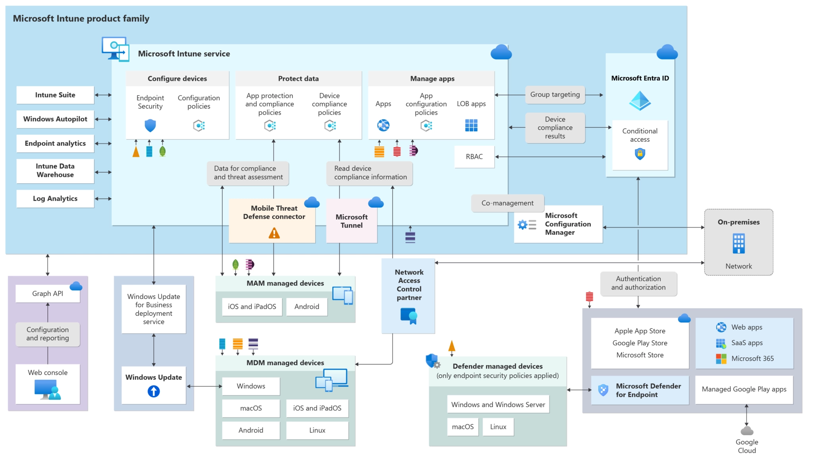
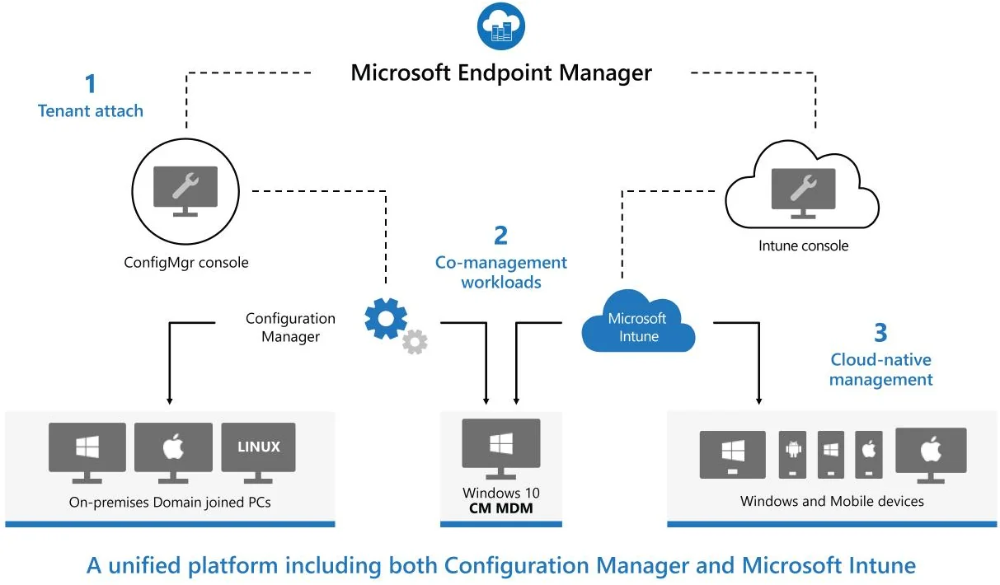

# Intune & ConfigMgr CoManaged

Overview of Intune Service Family with co-managed setup: 



## Prerequisites

**Azure services and environment**

- Azure subscription
- Microsoft Entra ID P1 or P2
- Microsoft Intune subscription
- Microsoft Entra Connect (connected to your on-prem AD environment)
    
> [!Note]
> Devices that are only registered with Microsoft Entra ID aren't 
supported with co-management. This configuration is sometimes referred 
to as *workplace joined*. They need to be either joined to Microsoft Entra ID or Microsoft Entra hybrid joined. For more information, see [Handling devices with Microsoft Entra registered state](https://learn.microsoft.com/en-us/azure/active-directory/devices/hybrid-azuread-join-plan#handling-devices-with-azure-ad-registered-state).

**On-premises infrastructure**

- A [supported version](https://learn.microsoft.com/en-us/intune/configmgr/core/servers/manage/updates#supported-versions) of Configuration Manager current branch
- The mobile device management (MDM) authority must be set to Intune.

**Permissions**

Throughout this tutorial, use the following permissions to complete tasks:

- An account that's a *domain admin* on your on-premises infrastructure
- An account that's a *full administrator* for *all* scopes in Configuration Manager
- An account that's a *global administrator* in Microsoft Entra ID
    - Make sure you've assigned an Intune license to the account that you
    use to sign in to your tenant. Otherwise, sign in fails with the error
    message *An unanticipated error occurred*.

## Setup

By the end of this tutorial, you will have your Intune & SCCM in a co-managed configuration, mirroring the following diagram: 



When you're enabling co-management, you can use the Azure public 
cloud, Azure Government cloud, or Azure China 21Vianet cloud (added in 
version 2006). To enable co-management, follow these instructions:

1. In the Configuration Manager console, go to the **Administration** workspace, expand **Cloud Services**, and select the **Cloud Attach** node. Select **Configure Cloud Attach** on the ribbon to open the Cloud Attach Configuration Wizard.
    
    For version 2103 and earlier, expand **Cloud Services** and select the **Co-management** node. Select **Configure co-management** on the ribbon to open the Co-management Configuration Wizard.
    
2. On the onboarding page of the wizard, for **Azure environment**, choose one of the following environments:
    - Azure public cloud
    - Azure Government cloud
    - Azure China cloud (added in version 2006)
        
        Note
        
        Update the Configuration Manager client to the latest version on your devices before you onboard to the Azure China cloud.
        
    
    When you select the Azure China cloud or Azure Government cloud, the **Upload to Microsoft Endpoint Manager admin center** option for [tenant attach](https://learn.microsoft.com/en-us/intune/configmgr/tenant-attach/device-sync-actions) is disabled.
    
3. Select **Sign In**. Sign in as a Microsoft Entra Global Administrator, and then select **Next**. You sign in this one time for the purposes of this wizard. The credentials aren't stored or reused elsewhere.
4. On the **Enablement** page, choose the following settings:
    - **Automatic enrollment in Intune**: Enables
    automatic client enrollment in Intune for existing Configuration Manager clients. This option allows you to enable co-management on a subset of
    clients to initially test co-management and then roll out co-management
    by using a phased approach. If the user unenrolls a device, the device
    will be re-enrolled on the next evaluation of the policy.
        - **Pilot**: Only the Configuration Manager clients that are members of the **Intune Auto Enrollment** collection are automatically enrolled in Intune.
        - **All**: Enable automatic enrollment for all clients running Windows 10 version 1709 or later.
        - **None**: Disable automatic enrollment for all clients.
    - **Intune Auto Enrollment**: This collection should
    contain all of the clients that you want to onboard into co-management.
    It's essentially a superset of all the other staging collections.
    
    
    
    Automatic enrollment isn't immediate for all clients. This behavior 
    helps enrollment scale better for large environments. Configuration 
    Manager randomizes enrollment based on the number of clients. For 
    example, if your environment has 100,000 clients, when you enable this 
    setting, enrollment occurs over several days.
    
    A new co-managed device is now automatically enrolled in the 
    Microsoft Intune service based on its Microsoft Entra device token. It 
    doesn't need to wait for a user to sign in to the device for automatic 
    enrollment to start. This change helps to reduce the number of devices 
    with the enrollment status **Pending user sign in**. To support this behavior, the device needs to be running Windows 10 version 1803 or later. For more information, see [Co-management enrollment status](https://learn.microsoft.com/en-us/intune/configmgr/comanage/how-to-monitor#co-management-enrollment-status).
    
    If you already have devices enrolled in co-management, new devices are now enrolled immediately after they meet the [prerequisites](https://learn.microsoft.com/en-us/intune/configmgr/comanage/overview#prerequisites).
    
5. For internet-based devices that are already enrolled in Intune, copy and save the command on the **Enablement** page. You'll use this command to install the Configuration Manager
client as an app in Intune for internet-based devices. If you don't save this command now, you can review the co-management configuration at any time to get this command.
    
    Tip
    
    The command appears only if you've met all of the prerequisites, such as setting up a cloud management gateway.
    
6. On the **Workloads** page, for each workload, choose which device group to move over for management with Intune. For more information, see [Workloads](https://learn.microsoft.com/en-us/intune/configmgr/comanage/workloads).
    
    If you only want to enable co-management, you don't need to switch 
    workloads now. You can switch workloads later. For more information, see
     [How to switch workloads](https://learn.microsoft.com/en-us/intune/configmgr/comanage/how-to-switch-workloads).
    
    - **Pilot Intune**: Switches the associated workload only for the devices in the pilot collections that you'll specify on the **Staging** page. Each workload can have a different pilot collection.
    - **Intune**: Switches the associated workload for all co-managed Windows 10 or later devices.
    
    Important
    
    Before you switch any workloads, make sure that you properly 
    configure and deploy the corresponding workload in Intune. Make sure 
    that workloads are always managed by one of the management tools for 
    your devices.
    
7. On the **Staging** page, specify the pilot collection for each of the workloads that are set to **Pilot Intune**.
    
    
    
8. To enable co-management, complete the wizard.
   1. To Sync Users, go to the [Enable SCCM AAD User Discovery Doc.](./AAD_User_Discovery.md)

# Troubleshooting tenant attach and device actions

*Applies to: Configuration Manager (current branch)*

Configuration Manager clients can be synced to Microsoft Intune admin
 center. Some client actions can be run from the Microsoft Intune admin 
center on the synchronized clients.

The available actions are:

- Sync Machine Policy
- Sync User Policy
- App Evaluation Cycle


When an admin runs an action from Microsoft Intune admin center, the 
notification request is forwarded to Configuration Manager site, and 
from the site to the client.

## **Log files**

Use the following logs located on the service connection point:

- **CMGatewaySyncUploadWorker.log**
- **CMGatewayNotificationWorker.log**

Use the following logs located on the management point:

- **BgbServer.log**

Use the following logs located on the client:

- **CcmNotificationAgent.log**

## **Review your upload**

1. Open **CMGatewaySyncUploadWorker.log** from <ConfigMgr install directory>\Logs.
2. The next sync time is noted by log entries similar to `Next run time will be at approximately: 02/28/2020 16:35:31`.
3. For device uploads, look for log entries similar to `Batching N records`. **N** is the number of changed devices uploaded since the last upload.
4. The upload occurs every 15 minutes for changes. Once changes are
uploaded, it may take an additional 5 to 10 minutes for client changes
to appear in **Microsoft Intune admin center**.

## **Configuration Manager components and log flow**

- **SMS_SERVICE_CONNECTOR**: Uses the Gateway Notification Worker for processing the notification from Microsoft Intune admin center.
- **SMS_NOTIFICATION_SERVER**: Gets the notification and creates a client notification.
- **BgbAgent**: The client gets task and runs the requested action.

## **SMS_SERVICE_CONNECTOR**

When an action is initiated from the Microsoft Intune admin center, **CMGatewayNotificationWorker.log** processes the request.

```txt
Received new notification. Validating basic notification details...
Validating device action message content...
Authorized to perform client action. TemplateID: RequestMachinePolicy TenantId: a1b2c3a1-b2c3-d4a1-b2c3-d4a1b2c3a1b2 AADUserID:     a1b2c3a1-b2c3-d4a1-b2c3-d4a1b2c3a1b2
Forwarded BGB remote task. TemplateID: 1 TaskGuid: a43dd1b3-a006-4604-b012-5529380b3b6f TaskParam: TargetDeviceIDs: 1

```

1. A notification is received from Microsoft Intune admin center.
- `Received new notification. Validating basic notification details..`
- User and device actions are validated.
- `Validating device action message content...
Authorized to perform client action. TemplateID: RequestMachinePolicy TenantId: a1b2c3a1-b2c3-d4a1-b2c3-d4a1b2c3a1b2 AADUserID: a1b2c3a1-b2c3-d4a1-b2c3-d4a1b2c3a1b2`
- The remote task is forwarded to the SMS_NOTIFICATION_SERVER.
    
1. `Forwarded BGB remote task. TemplateID: 1 TaskGuid: a43dd1b3-a006-4604-b012-5529380b3b6f TaskParam: TargetDeviceIDs: 1`

## **SMS_NOTIFICATION_SERVER**

Once the message is sent to the SMS_NOTIFICATION_SERVER, a task is 
sent from the management point to the corresponding client. You'll see 
the below in the **BgbServer.log**, which is on the management point:

```
Get one push message from database.
Starting to send push task (PushID: 7 TaskID: 8 TaskGUID: A43DD1B3-A006-4604-B012-5529380B3B6F TaskType: 1 TaskParam: ) to 1 clients  with throttling (strategy: 1 param: 42)

```

## **BgbAgent**

The last step occurs on the client and can be seen in the **CcmNotificationAgent.log**.
 Once the task is received, it will request scheduler to perform the 
action. When the action is performed, you'll see a confirmation message:

```
Receive task from server with pushid=7, taskid=8, taskguid=A43DD1B3-A006-4604-B012-5529380B3B6F, tasktype=1 and taskParam=

Send Task response message <BgbResponseMessage TimeStamp="2020-01-21T15:43:43Z"><PushID>8</PushID><TaskID>9</TaskID><ReturnCode>1</ReturnCode></BgbResponseMessage> successfully.
```

## **Common issues**

### **Unauthorized to perform client action**

If the admin doesn't have the required permissions in Configuration Manager, you'll see an `Unauthorized` response in the **CMGatewayNotificationWorker.log**.

```
Received new notification. Validating basic notification details..
Validating device action message content...
Unauthorized to perform client action. TemplateID: RequestMachinePolicy TenantId: a1b2c3a1-b2c3-d4a1-b2c3-d4a1b2c3a1b2 AADUserID: 3a1e89e6-e190-4615-9d38-a208b0eb1c78

```

Ensure the user running the action from the Microsoft Intune admin 
center has the required permissions on Configuration Manager site. For 
more information, see [Microsoft Intune tenant attach prerequisites](https://learn.microsoft.com/en-us/intune/configmgr/tenant-attach/prerequisites).

## **Known issues**

### **Data synchronization failures**

If you have issues viewing the tenant attach details in the Microsoft
 Intune admin center, it may be because of an issue with the hierarchy 
onboarding configuration. This issue can be caused by onboarding a 
hierarchy that's already onboarded.

You can also detect this issue from entries in the **GenericUploadWorker.log** and **CMGatewayNotificationWorker.log** files. For more information, see [Example errors in log files that require resetting the tenant attach configuration](https://learn.microsoft.com/en-us/intune/configmgr/tenant-attach/troubleshoot#example-errors-in-log-files-that-require-resetting-the-tenant-attach-configuration).

### **Workaround for data synchronization failures**

To reset the tenant attach configuration:

1. Offboard the hierarchy. For more information, see [Offboard from tenant attach](https://learn.microsoft.com/en-us/intune/configmgr/tenant-attach/device-sync-actions#bkmk_offboard).
2. Wait at least two hours for the service to clean up the existing record.
3. Onboard the hierarchy again. For more information, see [Enable tenant attach](https://learn.microsoft.com/en-us/intune/configmgr/tenant-attach/device-sync-actions).

**Example errors in log files that require resetting the tenant attach configuration**

**Errors for AccountOnboardingInfo and DevicePost requests in GenericUploadWorker.log**

```
[OnboardScenario] Creating web request to: https://us.gateway.configmgr.manage.microsoft.com/api/gateway/AccountOnboardingInfo Method: POST Activity ID: ed2186a0-fb43-4cf1-84df-9283dd45a461 Timeout: 00:02:00
[OnboardScenario] Response from https://us.gateway.configmgr.manage.microsoft.com/api/gateway/AccountOnboardingInfo is: 400 (Bad Request)
Response status code: 400 (BadRequest) Activity ID: a579728b-eca0-4144-80ac-eea25ee5bcf6
Unexpected exception for worker GenericUploadWorker
Exception details:
[Critical][GenericUploadWorker][0][System.Net.WebException][0x80131509]
The remote server returned an error: (400) Bad Request.    at Microsoft.ConfigurationManager.ServiceConnector.ExtensionMethods.<GetResponseAsync>d__13.MoveNext()

[UploadDelta_HelpdeskUpload] Response from https://us.gateway.configmgr.manage.microsoft.com/api/gateway/DevicePost is: 401 (Unauthorized)
Response status code: 401 (Unauthorized) Activity ID: 6daac983-5f94-464e-b1bd-9b634a051d1d
[WebException]: Failed to upload data to 'https://us.gateway.configmgr.manage.microsoft.com/api/gateway/DevicePost'
Exception details:
[Warning][GenericUploadWorker][0][System.Net.WebException][0x80131509]
The remote server returned an error: (401) Unauthorized.    at Microsoft.ConfigurationManager.ServiceConnector.ExtensionMethods.<GetResponseAsync>d__13.MoveNext()

```

**Errors for device actions in CMGatewayNotificationWorker.log**

```
[GetNotifications] Response from https://us.gateway.configmgr.manage.microsoft.com/api/gateway/Notification is: 401 (Unauthorized)
Response status code: 401 (Unauthorized) Activity ID: 4c536a72-fd7f-4d08-948a-3e65d2129e44
Web exception when getting new notification
Exception details:
[Warning][CMGatewayNotificationWorker][0][System.Net.WebException][0x80131509]
The remote server returned an error: (401) Unauthorized.    at Microsoft.ConfigurationManager.ServiceConnector.ExtensionMethods.<GetResponseAsync>d__13.MoveNext()
Response in the web exception: {"Message":"An error has occurred."}

```

### **Specific devices don't synchronize**

It's possible that specific devices, which are Configuration Manager clients, won't be uploaded to the service.

**Impacted devices:**
If a device is a distribution point that uses the same PKI certificate 
for both the distribution point functionality and its client agent, then
 the device won't be included in the tenant attach device sync.

**Behavior:** When performing tenant attach during the 
on-boarding phase, a full sync is performed the first time. Subsequent 
sync cycles are delta synchronizations. Any update to the impacted 
devices will cause the device to be removed from the sync.

 **When the Configuration Manager site is configured to require 
multi-factor authentication, most tenant attach features don't work**

**Scenario:** If the [SMS provider](https://learn.microsoft.com/en-us/intune/configmgr/core/plan-design/hierarchy/plan-for-the-sms-provider) machine that communicates with the [service connection point](https://learn.microsoft.com/en-us/intune/configmgr/core/servers/deploy/configure/about-the-service-connection-point)
 is configured to use multi-factor authentication, you can't install 
applications, run CMPivot queries, and perform other actions from the 
admin console. You receive an error code 403, forbidden.

**Workaround:** The current workaround is to configure the on-premises hierarchy to the default authentication level of **Windows authentication**. For more information, see the [Authentication section in the SMS provider article](https://learn.microsoft.com/en-us/intune/configmgr/core/plan-design/hierarchy/plan-for-the-sms-provider#authentication).