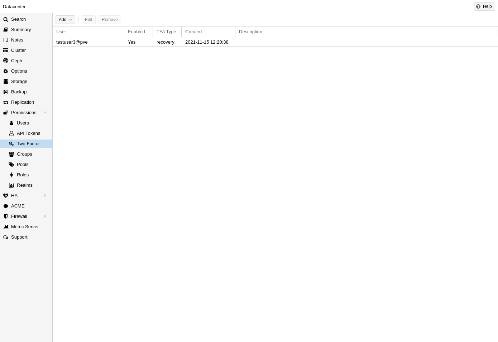

# Two Factor Authentication Setup

There are two ways to use two-factor authentication:

It can be required by the authentication realm, either via **TOTP** (Time-based One-Time Password) or YubiKey
OTP. In this case, a newly created user needs to have their keys added immediately, as there is no way to
log in without the second factor. In the case of TOTP, users can also change the TOTP later on, provided
they can log in first.

Alternatively, users can choose to opt-in to two-factor authentication later on, even if the realm does not
enforce it.

## Available 2FA Providers

You can set up multiple second factors, in order to avoid a situation in which losing your smartphone or
security key locks you out of your account permanently.
The following two-factor authentication methods are available in addition to realm-enforced TOTP and Yu-
biKey OTP:

- User configured TOTP (Time-based One-Time Password). A short code derived from a shared secret and
the current time, it changes every 30 seconds.
- WebAuthn (Web Authentication). A general standard for authentication. It is implemented by various
security devices, like hardware keys or trusted platform modules (TPM) from a computer or smart phone.
- Single use Recovery Keys. A list of keys which should either be printed out and locked in a secure place
or saved digitally in an electronic vault. Each key can be used only once. These are perfect for ensuring
that you are not locked out, even if all of your other second factors are lost or corrupt.

Before WebAuthn was supported, U2F could be setup by the user. Existing U2F factors can still be used,
but it is recommended to switch to WebAuthn, once it is configured on the server.

## User Configured TOTP Authentication

Users can choose to enable TOTP or WebAuthn as a second factor on login, via the TFA button in the user list (unless the realm enforces YubiKey OTP).

Users can always add and use one time Recovery Keys.

{ style="width: 70%; margin: auto;"}\

After opening the TFA window, the user is presented with a dialog to set up TOTP authentication. The Secret field contains the key, which can be randomly generated via the Randomize button. An optional Issuer Name can be added to provide information to the TOTP app about what the key belongs to. Most TOTP apps will show the issuer name together with the corresponding OTP values. The username is also included in the QR code for the TOTP app.

After generating a key, a QR code will be displayed, which can be used with most OTP apps such as FreeOTP. The user then needs to verify the current user password (unless logged in as root), as well as the ability to correctly use the TOTP key, by typing the current OTP value into the Verification Code field and pressing the Apply button.

## User setup guide

1. Click on your username in the top right corner of PVE webpage. 
2. Click TFA. 
3. You will be directed to a page similar to the screenshot above. 
4. Click Add, and choose TOTP from the drop down list. 
5. Enter your password to verify yourself. 
6. Give your TOTP a name, related to the device/application you're using as your Two-Factor provider. ie. "pixel-7 authy"
7. Scan the QR code in your 2FA application and setup the account there. 
8. Enter the 6 digit code generated by your 2FA application and your Proxmox password then click Add. 

> As an admin, you can generated 2FA codes for other users except for the built in root account. 