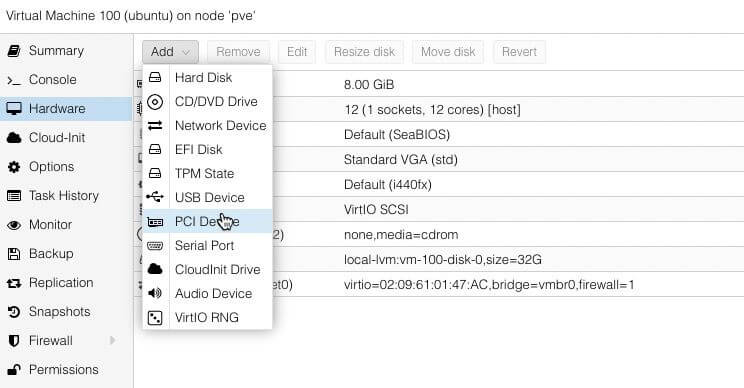
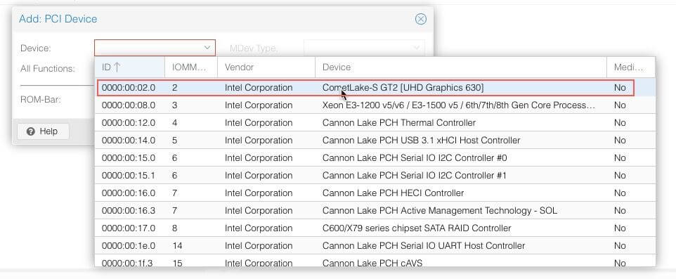
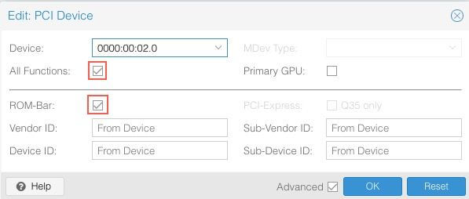
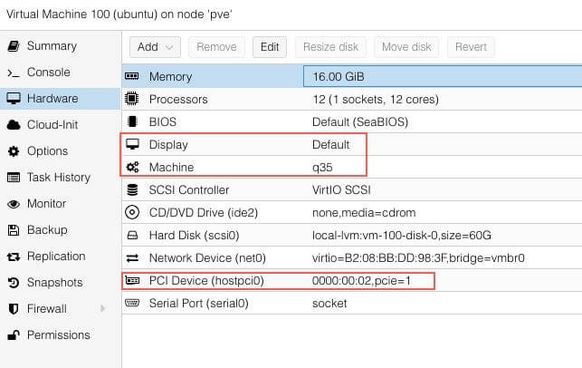

# iGPU passthrough
- https://3os.org/infrastructure/proxmox/gpu-passthrough/igpu-passthrough-to-vm/#linux-virtual-machine-igpu-passthrough-configuration

Introduction¶

Intel Integrated Graphics (iGPU) is a GPU that is integrated into the CPU. The GPU is a part of the CPU and is used to render graphics. Proxmox may be configured to use iGPU passthrough to VM to allow the VM to use the iGPU for hardware acceleration for example using video encoding/decoding and Transcoding for series like Plex and Emby. This guide will show you how to configure Proxmox to use iGPU passthrough to VM.

    Your mileage may vary depending on your hardware. The following guide was tested with Intel Gen6 CPU.

There are two ways to use iGPU passthrough to VM. The first way is to use the Full iGPU Passthrough to VM. The second way is to use the iGPU GVT-g technology which allows as to split the iGPU into two parts. We will be covering the Full iGPU Passthrough. If you want to use the split iGPU GVT-g Passthrough you can find the guide here.
Proxmox Configuration for iGPU Full Passthrough¶

The following examples uses SSH connection to the Proxmox server. The editor is nano but feel free to use any other editor. We will be editing the grub configuration file.

Edit the grub configuration file.

    nano /etc/default/grub

Find the line that starts with GRUB_CMDLINE_LINUX_DEFAULT by default they should look like this:

    GRUB_CMDLINE_LINUX_DEFAULT="quiet"

We want to allow passthrough and Blacklists known graphics drivers to prevent proxmox from utilizing the iGPU.
<blockquote>
Warning

You will loose the ability to use the onboard graphics card to access the Proxmox's console since Proxmox won't be able to use the Intel's gpu
</blockquote>
Your `GRUB_CMDLINE_LINUX_DEFAULT` should look like this:

    GRUB_CMDLINE_LINUX_DEFAULT="quiet intel_iommu=on iommu=pt pcie_acs_override=downstream,multifunction initcall_blacklist=sysfb_init video=simplefb:off video=vesafb:off video=efifb:off video=vesa:off disable_vga=1 vfio_iommu_type1.allow_unsafe_interrupts=1 kvm.ignore_msrs=1 modprobe.blacklist=radeon,nouveau,nvidia,nvidiafb,nvidia-gpu,snd_hda_intel,snd_hda_codec_hdmi,i915"

<blockquote>
Note

This will blacklist most of the graphics drivers from proxmox. If you have a specific driver you need to use for Proxmox Host you need to remove it from modprobe.blacklist
</blockquote>

Save and exit the editor.

Update the grub configuration to apply the changes the next time the system boots.

    update-grub

Next we need to add vfio modules to allow PCI passthrough.

Edit the `/etc/modules` file.

    nano /etc/modules

Add the following line to the end of the file:
```
# Modules required for PCI passthrough
vfio
vfio_iommu_type1
vfio_pci
vfio_virqfd
```
Update configuration changes made in your /etc filesystem

`update-initramfs -u -k all`

Save and exit the editor.

Reboot Proxmox to apply the changes

Verify that IOMMU is enabled

`dmesg | grep -e DMAR -e IOMMU`

There should be a line that looks like DMAR: IOMMU enabled. If there is no output, something is wrong.
```bash
[0.000000] Warning: PCIe ACS overrides enabled; This may allow non-IOMMU protected peer-to-peer DMA
[0.067203] DMAR: IOMMU enabled
[2.573920] pci 0000:00:00.2: AMD-Vi: IOMMU performance counters supported
[2.580393] pci 0000:00:00.2: AMD-Vi: Found IOMMU cap 0x40
[2.581776] perf/amd_iommu: Detected AMD IOMMU #0 (2 banks, 4 counters/bank).
```
### Linux Virtual Machine iGPU Passthrough Configuration

We will be using Ubuntu Server 20.04 LTS for this guide. (I used fedora 37 without issue)

From Proxmox Terminal find the PCI address of the iGPU.

    lspci -nnv | grep VGA

This should result in output similar to this:

```bash
00:02.0 VGA compatible controller [0300]: Intel Corporation CometLake-S GT2 [UHD Graphics 630] [8086:3e92] (prog-if 00 [VGA controller])
```

If you have multiple VGA, look for the one that has the Intel in the name. Here, the PCI address of the iGPU is `00:02.0`.

Head over to proxmox webGUI, and into hardware section of VM you want the GPU on. 



Open the `Device` dropdown and select the iGPU, which you can find using it’s PCI address. This list uses a different format for the PCI addresses id, `00:02.0` is listed as `0000:00:02.0`.



Select All Functions, ROM-Bar and then click Add.



The Ubuntu Virtual Machine Proxmox Setting should look like this:



Boot the VM. To test the iGPU passthrough was successful, you can use the following command:

    sudo lspci -nnv | grep VGA

The output should include the Intel iGPU:

    00:10.0 VGA compatible controller [0300]: Intel Corporation UHD Graphics 630 (Desktop) [8086:3e92] (prog-if 00 [VGA controller])

Now we need to check if the GPU's Driver initalization is working.

    cd /dev/dri && ls -la

The output should include the `renderD128`

## Jellyfin QSV

Jellyfin wasn't wanting to encode some videos but played others just fine, attempting install of intel video drivers to see if that resolves the issue: 

pulled from: https://www.linuxfordevices.com/tutorials/ubuntu/install-intel-graphic-drivers

Add intel repositories for Ubuntu Jammy: 
Old method: 
```bash
sudo apt install -y gpg-agent wget
wget -qO - https://repositories.intel.com/graphics/intel-graphics.key |
  sudo apt-key add -
sudo apt-add-repository \
  'deb [arch=amd64] https://repositories.intel.com/graphics/ubuntu jammy main'
```
For Ubuntu 22.04: 

```bash
# sudo apt-get install -y gpg-agent wget # if not installed already
wget -qO - https://repositories.intel.com/graphics/intel-graphics.key | \
  sudo gpg --dearmor --output /usr/share/keyrings/intel-graphics.gpg
echo 'deb [arch=amd64,i386 signed-by=/usr/share/keyrings/intel-graphics.gpg] https://repositories.intel.com/graphics/ubuntu jammy arc' | \
  sudo tee  /etc/apt/sources.list.d/intel.gpu.jammy.list
```
Now update `apt` and install graphics package: 

```bash
sudo apt update
sudo apt install \
  intel-opencl-icd \
  intel-level-zero-gpu level-zero \
  intel-media-va-driver-non-free libmfx1
```
tested 4/23/2023 and still getting errors on HVEC playback. 
