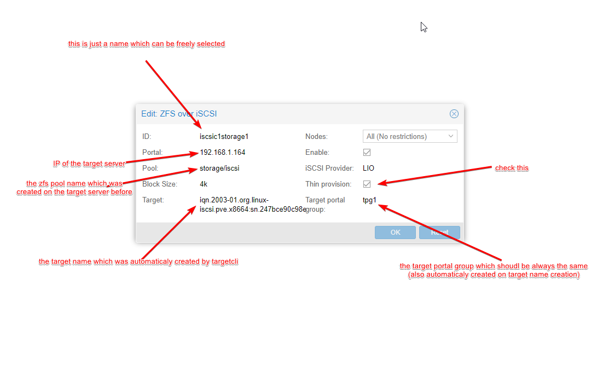

# ZFS over ISCSI

Have this at least set up now.. but am failing to start VM full errora; 
```bash
kvm: -drive file=iscsi://192.168.0.118/iqn.2003-01.org.linux-iscsi.heimdall.x8664:sn.f461fed3663d/0,if=none,id=drive-scsi0,format=raw,cache=none,aio=io_uring,detect-zeroes=on: iSCSI: Failed to connect to LUN : iscsi_service failed with : iscsi_service_reconnect_if_loggedin. Can not reconnect right now.

TASK ERROR: start failed: QEMU exited with code 1
```
current target: iqn.2003-01.org.linux-iscsi.heimdall.x8664:sn.f461fed3663d
group tpg1
zpool tank
thin provision

annnnndddd I just fixed it....was the portal, I had it backwards in my head, portal should have been host IP address instead of PVE nodes ip addresses. 

## Removing Orphaned disks

So, in the setup/testing process, I ended up with a lot of extra disks for vm 112 that I couldn't delete from GUI, first it complained about VM 112 existing. It was for testing so I deleted it. And I was still unable to remove the disk as GUI complained it didn't exist...yet I see it in the GUI and on iscsi host...Couldn't find disks on PVE host, but could see them with `pvesm scan iscsi <portal_ip_address>`. 

Ended up SSHing into `portal` and ran `zfs list tank` which showed the orphaned VM disks that proxmox saw. I was able to remove them without issue with `zfs destroy /tank/vm-112-disk0`. 

Ran into an issue later on with a Kali install, rebooted VM and it couldn't see iscsi disks anymore, ended up deleting the VM as it was fresh install anyway. Disk is still showing up, couldn't delete it with the VM, can't remove it from proxmox, can't remove it from ZFS either...first option is going to be reboot of `heimdall`.

## Changing IP addresses

Recently migranted LAN to new subnet of 10.0.0.0/16. I updated `storage.cfg` to reflect the new IP's for nfs but iscsi didn't mount up after ip's were changed router and hosts rebooted. After rereading the notes below, I realized I needed to sign into the ISCSI host with the dedicated ssh key (located at `/etc/pve/priv/zfs/`), accept the new host and we should be good to go...but we weren't. 

After reading the timeout error when trying to view the disks on an iscsi mount, I noticed PVE was trying to use an ssh key with the new IP address. I was able to rename the public and private keys in PVE, verified I could still sign in with them and restarted `iscsid.service`. Then I just needed to start the VM's that live on iscsi target and all was well. 

# My setup for ZFS over ISCSI

2x300gb 10krpm SAS drives in zfs stripe - This is a testing ground, idgaf about data here. For Production, I'd use 4 drives in a striped mirror. Enabled lz4 compression and deduplication for this pool.

2x1Tb Crucial MX500 SSD's in zfs mirror. More production ready iscsi target. Enabled lz4 compression and deduplication for this pool.

- [although a guide for freenas, this was immensely helpful](https://forum.proxmox.com/threads/iscsi-failed-to-connect-to-lun-iscsi_service-failed.82179/)
- [Most excellent guide, auf deutch](https://deepdoc.at/dokuwiki/doku.php?id=virtualisierung:proxmox_kvm_und_lxc:proxmox_debian_als_zfs-over-iscsi_server_verwenden)
- [another stackoverflow link iscsiadm cannot make connection to...connection refused](https://stackoverflow.com/questions/42096147/iscsiadm-cannot-make-connection-to-connection-refused)
- [Link I found troubleshooting auth issues on new client](https://www.thegeekdiary.com/how-to-configure-iscsi-target-and-initiator-using-targetcli-in-centos-rhel-7/)

ssh into storage server (heimdall in my case)  
installed targetcli on heimdall where drives live.  
`sudo apt install targetcli-fb`

enabled iscsi daemon service `systemctl enable iscsid.service`. 

enable targetcli service `systemctl enable targetcli.service`

FROM PVE SERVER: get iscsi initiator name from PVE: `cat /etc/iscsi/initiatorname.iscsi ` this will be used later for the ACL's, you will need this from each server using the iscsi target. 

FROM STORAGE SERVER (target) Run `sudo targetcli`
- lands you in target cli shell
```bash
/ >  ls
o- / .....................................................................................................  [ ... ] 
  o- backstores ..........................................................................................  [ ... ] 
  | o- block ..............................................................................  [ Storage Objects:  0 ] 
  | o- fileio .............................................................................  [ Storage Objects:  0 ] 
  | o- pscsi ..............................................................................  [ Storage Objects:  0 ] 
  | o- ramdisk ............................................................................  [ Storage Objects:  0 ] 
  o- iscsi ........................................................................................  [ Targets:  0 ] 
  o- loopback .....................................................................................  [ Targets:  0 ] 
  o- sbp ..........................................................................................  [ Targets:  0 ] 
  o- vhost ........................................................................................  [ Targets:  0 ] 
  ```

- cd into iscsi `cd ./iscsi`
- create one with `create` creates an iscsi target with default name.
- `cd` into this new iscsi target
  - create target portal group, ie `tpg1` 
  - create an ACL for clients (initiator's `cd` into `acls`) `create <initiatorname>` The `<initiatorname>` is the name we grabbed from `/etc/iscsi/initiatorname.iscsi`
- cd from `tpg1`, cd into `portals`
- accept the default of `0.0.0.0:3260` or set the IP address of your server. 
- run `saveconfig` then `exit`
- for good measure, I restarted both `iscsid.service` and `targetcli.service`

pve storage.cfg example: 
```cfg
zfs: iscsi-zfs
        blocksize 4k
        iscsiprovider LIO
        pool testpool/iscsi
        portal backup.tux.at
        target iqn.2019-03.org.linux-iscsi.backup.tux.at:sn.baef28cdfaff
        content images
        lio_tpg tpg1
        nowritecache 1
        sparse 1 
```

and from PVE GUI:  



iscsi targetcli completed setup:
```bash
/> ls
o- / ................................................................................................... [...]
  o- backstores ........................................................................................ [...]
  | o- block ............................................................................ [Storage Objects: 2]
  | | o- tank-vm-102-disk-0 ........................ [/dev/tank/vm-102-disk-0 (100.0GiB) write-thru activated]
  | | | o- alua ............................................................................. [ALUA Groups: 1]
  | | |   o- default_tg_pt_gp ................................................. [ALUA state: Active/optimized]
  | | o- tank-vm-113-disk-0 ......................... [/dev/tank/vm-113-disk-0 (32.0GiB) write-thru activated]
  | |   o- alua ............................................................................. [ALUA Groups: 1]
  | |     o- default_tg_pt_gp ................................................. [ALUA state: Active/optimized]
  | o- fileio ........................................................................... [Storage Objects: 0]
  | o- pscsi ............................................................................ [Storage Objects: 0]
  | o- ramdisk .......................................................................... [Storage Objects: 0]
  o- iscsi ...................................................................................... [Targets: 1]
  | o- iqn.2003-01.org.linux-iscsi.heimdall.x8664:sn.f461fed3663d .................................. [TPGs: 1]
  |   o- tpg1 ......................................................................... [no-gen-acls, no-auth]
  |     o- acls .................................................................................... [ACLs: 2]
  |     | o- iqn.1993-08.org.debian:01:1acae2a35ba7 ......................................... [Mapped LUNs: 2]
  |     | | o- mapped_lun0 .............................................. [lun0 block/tank-vm-113-disk-0 (rw)]
  |     | | o- mapped_lun1 .............................................. [lun1 block/tank-vm-102-disk-0 (rw)]
  |     | o- iqn.1993-08.org.debian:01:e79cf44cb13c ......................................... [Mapped LUNs: 2]
  |     |   o- mapped_lun0 .............................................. [lun0 block/tank-vm-113-disk-0 (rw)]
  |     |   o- mapped_lun1 .............................................. [lun1 block/tank-vm-102-disk-0 (rw)]
  |     o- luns .................................................................................... [LUNs: 2]
  |     | o- lun0 .................... [block/tank-vm-113-disk-0 (/dev/tank/vm-113-disk-0) (default_tg_pt_gp)]
  |     | o- lun1 .................... [block/tank-vm-102-disk-0 (/dev/tank/vm-102-disk-0) (default_tg_pt_gp)]
  |     o- portals .............................................................................. [Portals: 3]
  |       o- 192.168.0.112:3260 ......................................................................... [OK]
  |       o- 192.168.0.118:3260 ......................................................................... [OK]
  |       o- 192.168.0.12:3260 .......................................................................... [OK]
  o- loopback ................................................................................... [Targets: 0]
  o- vhost ...................................................................................... [Targets: 0]
/> exit
```
## Adding new pools/drives
This was as simple as installing the drives, setting up the zpool, then adding new zfs over iscsi storage in proxmox GUI. Used same target name as original setup. 

From the [docs](https://pve.proxmox.com/pve-docs/pve-admin-guide.html#storage_zfs)
## 7.18. ZFS over ISCSI Backend

Storage pool type: zfs

This backend accesses a remote machine having a ZFS pool as storage and an iSCSI target implementation via ssh. For each guest disk it creates a ZVOL and, exports it as iSCSI LUN. This LUN is used by Proxmox VE for the guest disk.

The following iSCSI target implementations are supported:

    LIO (Linux)

    IET (Linux)

    ISTGT (FreeBSD)

    Comstar (Solaris)

Note 	This plugin needs a ZFS capable remote storage appliance, you cannot use it to create a ZFS Pool on a regular Storage Appliance/SAN
### 7.18.1. Configuration

In order to use the ZFS over iSCSI plugin you need to configure the remote machine (target) to accept ssh connections from the Proxmox VE node. Proxmox VE connects to the target for creating the ZVOLs and exporting them via iSCSI. Authentication is done through a ssh-key (without password protection) stored in /etc/pve/priv/zfs/<target_ip>_id_rsa

The following steps create a ssh-key and distribute it to the storage machine with IP 192.0.2.1:

    mkdir /etc/pve/priv/zfs
    ssh-keygen -f /etc/pve/priv/zfs/192.0.2.1_id_rsa
    ssh-copy-id -i /etc/pve/priv/zfs/192.0.2.1_id_rsa.pub root@192.0.2.1
    ssh -i /etc/pve/priv/zfs/192.0.2.1_id_rsa root@192.0.2.1

The backend supports the common storage properties content, nodes, disable, and the following ZFS over ISCSI specific properties:

pool

    The ZFS pool/filesystem on the iSCSI target. All allocations are done within that pool.
portal

    iSCSI portal (IP or DNS name with optional port).
target

    iSCSI target.
iscsiprovider

    The iSCSI target implementation used on the remote machine
comstar_tg

    target group for comstar views.
comstar_hg

    host group for comstar views.
lio_tpg

    target portal group for Linux LIO targets
nowritecache

    disable write caching on the target
blocksize

    Set ZFS blocksize parameter.
sparse

    Use ZFS thin-provisioning. A sparse volume is a volume whose reservation is not equal to the volume size.

Configuration Examples (/etc/pve/storage.cfg)

    zfs: lio
    blocksize 4k
    iscsiprovider LIO
    pool tank
    portal 192.0.2.111
    target iqn.2003-01.org.linux-iscsi.lio.x8664:sn.xxxxxxxxxxxx
    content images
    lio_tpg tpg1
    sparse 1

    zfs: solaris
    blocksize 4k
    target iqn.2010-08.org.illumos:02:xxxxxxxx-xxxx-xxxx-xxxx-xxxxxxxxxxxx:tank1
    pool tank
    iscsiprovider comstar
    portal 192.0.2.112
    content images

    zfs: freebsd
    blocksize 4k
    target iqn.2007-09.jp.ne.peach.istgt:tank1
    pool tank
    iscsiprovider istgt
    portal 192.0.2.113
    content images

    zfs: iet
    blocksize 4k
    target iqn.2001-04.com.example:tank1
    pool tank
    iscsiprovider iet
    portal 192.0.2.114
    content images

### 7.18.2. Storage Features

The ZFS over iSCSI plugin provides a shared storage, which is capable of snapshots. You need to make sure that the ZFS appliance does not become a single point of failure in your deployment.
Table 16. Storage features for backend iscsi 
| Content types 	| Image formats 	| Shared 	| Snapshots 	| Clones|
|--- |--- |--- |---|---|
| images | raw | yes | yes | no | 