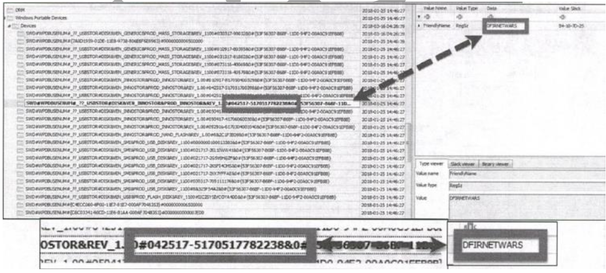

[back](./README.md)

# USB Forensic

- [USB Forensic](#usb-forensic)
  - [MTP AND MSC](#mtp-and-msc)
    - [MSC Device:](#msc-device)
    - [MTP Devices:](#mtp-devices)
  - [USBSTOR](#usbstor)
  - [USB](#usb)
  - [Volume Name and GUID](#volume-name-and-guid)
    - [Windows 10 Example:](#windows-10-example)
- [Drive Letter and User and Volume GUID](#drive-letter-and-user-and-volume-guid)
  - [MSC Only (Windows 7-10)](#msc-only-windows-7-10)
    - [Steps to Find Last Drive Letter of a USB Device](#steps-to-find-last-drive-letter-of-a-usb-device)
      - [4. Retrieve Device Serial Number](#4-retrieve-device-serial-number)
      - [5. Examine SYSTEM Hive and MountedDevices Key](#5-examine-system-hive-and-mounteddevices-key)
      - [6. Find Drive Letter Using Serial Number](#6-find-drive-letter-using-serial-number)
    - [Steps to Locate Volume GUID](#steps-to-locate-volume-guid)
      - [7. Search MountedDevices for Serial Number](#7-search-mounteddevices-for-serial-number)
      - [8. Identify the Relevant GUID](#8-identify-the-relevant-guid)
  - [Mapping GUID to User](#mapping-guid-to-user)
    - [NTUSER.DAT Hive](#ntuserdat-hive)
    - [USB First Time Device Connected Logs](#usb-first-time-device-connected-logs)
  - [Event Logging](#event-logging)
    - [9. Event ID 20001](#9-event-id-20001)
    - [10. DriverFrameworks UserMode](#10-driverframeworks-usermode)
    - [11. Event ID 4663](#11-event-id-4663)
    - [12. Event ID 4656](#12-event-id-4656)
    - [13. Event ID 6416](#13-event-id-6416)
    - [14. MBAM/Operational Log](#14-mbamoperational-log)
      - [**Tip:**](#tip)
  - [EMDMgmt Key (Optional: Finding Your USB's Volume Serial Number)](#emdmgmt-key-optional-finding-your-usbs-volume-serial-number)
    - [Steps to Find Volume Serial Number](#steps-to-find-volume-serial-number)
      - [15. Check the Volume Info](#15-check-the-volume-info)
      - [16. Look in the Registry](#16-look-in-the-registry)
      - [17. Convert to Hex](#17-convert-to-hex)
    - [**Why Bother?**](#why-bother)
  - [Quick Guide for Windows](#quick-guide-for-windows)
    - [18. Vendor, Product, Version](#18-vendor-product-version)
    - [19. USB Unique Serial Number ID](#19-usb-unique-serial-number-id)
    - [20. Vendor-ID (VID) and Product-ID (PID)](#20-vendor-id-vid-and-product-id-pid)
    - [21. Volume GUIDs](#21-volume-guids)
    - [22. Drive Letter](#22-drive-letter)
    - [23. Volume Name](#23-volume-name)
    - [24. Volume Serial Number](#24-volume-serial-number)
    - [25. User of USB Device](#25-user-of-usb-device)
    - [26. First Time Device Connected](#26-first-time-device-connected)
    - [27. Last Time Device Connected](#27-last-time-device-connected)
    - [28. Time Device Removed](#28-time-device-removed)
    - [**Tips for Timestamps**](#tips-for-timestamps)


Mass Storage Class (MSC): - USB drive  
Picture Transfer Protocol (PTP): - pull stuff from your device. but you can't put stuff back on it.  
Media Transfer Protocol (MTP): - music, docs, and more.  
Windows Portable Devices (WPD): - it's like the universal translator for different device types.  
## MTP AND MSC
### MSC Device:  
you open files from MSC Device. you get these little LNK files.  
• `C:\Users\<username>\AppData\Roaming\Microsoft\Windows\Recent`: LNK files for all
files and folders you opened.  
• `C:\Users\Win 7SP1\AppData\Roaming\Microsoft\Office\Recent`: Just for Microsoft
Office files.
### MTP Devices:
it doesn't exist on Windows 10. When you open files from an MTP device, copies get saved in  
• `C:\Users\<Username>\AppData\Local\Temp\WPDNSE\`  
WPDNSE folder is temporary. Windows likes to clean it out when you reboot.
You'll see these weird GUIDs like `{02601-000-01CD-8801-7I017K017}` as folder names.

To Make sense:

1. Dive into the registry and look for the BagMRU entries related to your MTP device.
2. Find the folder GUIDs listed under these entries.
3. Match them up with the GUID-named folders in your WPDNSE directory.

## USBSTOR

Registry Key: `SYSTEM\CurrentControlSet\Enum\USBSTOR`  
• Disk&Ven: - Referred as Device class ID:  
• 57583..: - Referred as Unique device Serial #  
Search Smart: Use the "Find" option in Registry Explorer to search for keys with specific Serial  
Numbers across all loaded registry hives.  
USBSTOR keys could be cleared after 30 days.  

## USB

Registry Key: `SYSTEM\CurrentControlSet\Enum\USB`

Stores the Serial Number (VID) and Product ID (PID). VID_046D&PID_C077
This key is like a treasure trove for forensic investigators. Apart from storage devices, you can spot other gadgets like phones, tablets, and printers that were connected to the system—even if Windows didn't recognize them as mass storage devices.  

If you stumble upon an unknown VID or PID, there's a handy website to help you out:
[linux-usb.org/usb.ids](http://linux-usb.org/usb.ids).

Just plug in the numbers, and it'll reveal the manufacturer and product details.

## Volume Name and GUID

Registry key: `SOFTWARE\Microsoft\Windows Portable Devices\Devices`  
You can also grab the Volume Name (Friendly name) and GUID, which can be handy for future reference.

### Windows 10 Example:

Here's how it looks on Windows 10:  
• Windows Portable Devices Key: You'll find the Volume Name here.  
• Drive Letter: Unfortunately, not listed directly. But armed with the Volume Name, you can often trace it back using Shell Item historical information.  

Another example Taking # ---# value for further analysis: (This is Serial #)  



If there is Drive letter way to find drive letter:  

# Drive Letter and User and Volume GUID  

## MSC Only (Windows 7-10)  

### Steps to Find Last Drive Letter of a USB Device  

#### 4. Retrieve Device Serial Number  
- Retrieve the device Serial Number from the `USBSTOR` registry key, which was stored earlier.  

#### 5. Examine SYSTEM Hive and MountedDevices Key  
- Open the `SYSTEM` hive from the Windows registry.  
- Navigate to `HKEY_LOCAL_MACHINE\SYSTEM\MountedDevices`.  

#### 6. Find Drive Letter Using Serial Number  
- Search for the device Serial Number within the `MountedDevices` key.  
- The last device associated with a drive letter will have its Serial Number listed.  
- This indicates the drive letter assigned to that specific device.  

### Steps to Locate Volume GUID  

#### 7. Search MountedDevices for Serial Number  
- Look for the device's Serial Number within the data values of the various GUIDs in `SYSTEM\MountedDevices`.  

#### 8. Identify the Relevant GUID  
- Once the Serial Number is located, determine the corresponding GUID and note it down.  

## Mapping GUID to User  

### NTUSER.DAT Hive  

- Use the noted GUID to search through the `MountPoints2` key in the user's `NTUSER.DAT` hive.  
- This key is located at:  
  ```plaintext
  NTUSER.DAT\Software\Microsoft\Windows\CurrentVersion\Explorer\MountPoints2


### Mapping to User  
- Each Volume GUID listed under `MountPoints2` corresponds to a different local or removable drive connected to the system.  
- The Volume Serial Number from `SYSTEM\MountedDevices` should match one of the entries in `MountPoints2`, helping to identify the user associated with the device.  

---

## First Time, Last Time, and USB Removal  

### MSC USB Device Times to Track  

**USB Times:**  
- First time device is connected  
- Last time device is connected  
- Removal time  

**Registry Key:**  
```plaintext
HKLM\SYSTEM\CurrentControlSet\Enum\USBSTOR\Ven_Prod_Version\USB
iSerial#\Properties\{83da6326-97a6-4088-9453-a1923f573b29}\####
```
- **0064** = First Install (Win7 / 8)  
  - Also found in `setupapi.log` / `setupapi.dev.log` (Alternate)  
- **0066** = Last Connected (Win8+ only)  
  - Also found in `\Enum\USB\VID_XXXX&PID_YYYY` (last write time of USB Serial # key)  
- **0067** = Last Removal (Win8+ only)  
  - ```plaintext
    NTUSER\Software\Microsoft\Windows\CurrentVersion\Explorer\MountPoints2\{GUID}
    ```
  - Last write time of key (Alternate)  

### USB First Time Device Connected Logs  

- **XP:** `C:\Windows\setupapi.log`  
- **Vista+:** `C:\Windows\inf\setupapi.dev.log`  

Search for the device’s Serial # within these logs to discover the first time a device was plugged into a computer.  

---

## Event Logging  

### 9. Event ID 20001  
- When a USB or any device is plugged in, Windows tries to install its drivers automatically.  
- This action creates an "Event ID 20001" in the system logs.  

### 10. DriverFrameworks UserMode  
- Logs device connection and disconnection times.  

### 11. Event ID 4663  
- Records **BYOD (Bring Your Own Device)** usage after auditing is configured.  
- Links user accounts with device actions, like copying a file.  

### 12. Event ID 4656  
- Logs failed access attempts to removable devices.  

### 13. Event ID 6416  
- Within the **Advanced Audit Policy Configuration**, enabling `"Audit PNP Activity"` records every time a Plug and Play device is added to the system.  

### 14. MBAM/Operational Log  
- If the computer uses **BitLocker encryption**, the **MBAM/Operational log** records when removable media gets mounted or dismounted.  

#### **Tip:**  
- `"Audit Removable Storage"` (EID 4663) and `"Audit Plug and Play Activity"` (EID 6416) work well together for identifying user activity with timestamps.  

---

## EMDMgmt Key (Optional: Finding Your USB's Volume Serial Number)  

### Steps to Find Volume Serial Number  

#### 15. Check the Volume Info  
- Use a tool like `vol.exe` to find the **Volume Label** and **Serial Number** of your USB.  

#### 16. Look in the Registry  
- Open `Regedit` and navigate to:  
  ```plaintext
  SOFTWARE\Microsoft\Windows NT\CurrentVersion\EMDMgmt
  ```
- Search for your USB's Unique Serial Number or Volume Name.  
- The last number you see is your **Volume Serial Number** in decimal form.  

#### 17. Convert to Hex  
- Convert the decimal number to **Hex** using a calculator.  

### **Why Bother?**  
- Check the USB's **usage history**.  
- Analyze recent documents or shortcuts linked to the USB.  

---

## Quick Guide for Windows  

### 18. Vendor, Product, Version  
- **Path:**  
  ```plaintext
  SYSTEM\CurrentControlSet\Enum\USBSTOR
  ```
- **Vendor:**  
- **Product:**  
- **Version:**  

### 19. USB Unique Serial Number ID  
- **Path:**  
  ```plaintext
  SYSTEM\CurrentControlSet\Enum\USB
  ```
- **USB Unique Serial Number ID:**  

### 20. Vendor-ID (VID) and Product-ID (PID)  
- **Path:**  
  ```plaintext
  SYSTEM\CurrentControlSet\Enum\USB
  ```
- **VID:**  
- **PID:**  

### 21. Volume GUIDs  
- **Path:**  
  ```plaintext
  SYSTEM\MountedDevices
  ```
- **Volume GUID:**  

### 22. Drive Letter  
- **Path:**  
  ```plaintext
  SYSTEM\MountedDevices
  ```
- **Drive Letter:**  

**Or:**  
- **Path:**  
  ```plaintext
  NTUSER.DAT\Software\Microsoft\Windows\CurrentVersion\Explorer\RecentDocs
  ```
  - Perform **search for Volume Name**  
- Perform **Shortcut (LNK) file analysis**  
- **Drive Letter =**  

### 23. Volume Name  
- **Path:**  
  ```plaintext
  SOFTWARE\Microsoft\Windows Portable Devices\Devices
  ```
- **Search USB serial number and match with volume name**  
- **Volume Name:**  
- **Drive Letter (VISTA ONLY):**  

### 24. Volume Serial Number  
- **Path:**  
  ```plaintext
  SOFTWARE\Microsoft\Windows NT\CurrentVersion\EMDMgmt
  ```
- **Search volume name/Serial Number**  
- Convert Serial number to hex value for **link analysis**.  

### 25. User of USB Device  
- **Path:**  
  ```plaintext
  NTUSER.DAT\Software\Microsoft\Windows\CurrentVersion\Explorer\MountPoints2
  ```
- **User:**  

### 26. First Time Device Connected  
- **Path:**  
  ```plaintext
  C:\Windows\inf\setupapi.dev.log
  ```
- **Search unique serial number**  
- **Time/Timezone:**  

### 27. Last Time Device Connected  
- **Path:**  
  ```plaintext
  SYSTEM\CurrentControlSet\Enum\USB\VID_XXXX&PID_YYYY
  ```
- **Search serial number**  
- **Time/Timezone:**  

### 28. Time Device Removed  
- **Path:**  
  ```plaintext
  SYSTEM\CurrentControlSet\Enum\USBSTOR\Ven_Prod_Version\USB iSerial #
  ```
- **Use `DCodeDate` to decode timestamps.**  
```plaintext
{83da6326-97a6-4088-9453-a1923f573b29}\0067
```
- **Value = Windows 64-Bit Hex Value timestamp**  

---

### **Tips for Timestamps**  
- **For Windows 64-bit Hex Value timestamps, use `DCodeDate` to decode them.**
```