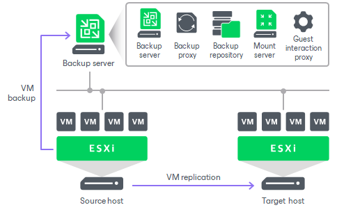
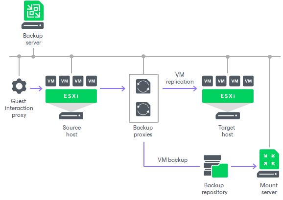
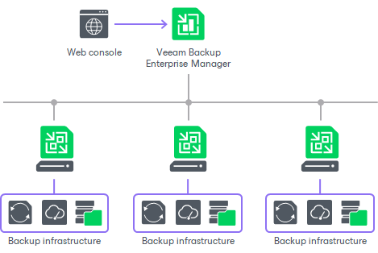

[back](./README.md)

# Deploy Veeam

Veeam Backup & Replication can be used in virtual environments of any size and complexity. The architecture of the solution supports on-site and off-site data protection, operations across remote sites and geographically dispersed locations. Veeam Backup & Replication provides flexible scalability and easily adapts to the needs of your virtual environment.

## Simple Deployment
The simple deployment scenario is good for small virtual environments or the purpose of the Veeam Backup & Replication evaluation. In this scenario, Veeam Backup & Replication and all services needed for data protection tasks are installed on a single Windows-based machine.

The machine where Veeam Backup & Replication is installed performs the following roles:

- Backup server that coordinates all jobs, controls their scheduling and performs other administrative activities.
- Default VMware backup proxy that handles job processing and transfers backup traffic.
- Default backup repository where backup files are stored. During installation, Veeam Backup & Replication checks volumes of the machine on which you install the product and
identifies a volume with the greatest amount of free disk space. On this volume, Veeam Backup & Replication creates the Backup folder that is used as the default backup repository.
- Mount server that is needed for restoring of VM guest OS files.
- Guest interaction proxy that is needed for application-aware processing,
guest file system indexing and transaction log processing.

Veeam is ready to use right after the installation. The only thing you need to do is add your VMware vSphere servers that you plane to use as source and target for backup, replication and other activities. 

## Advanced Deployment

In large-scale virtual environments with a large number of 
jobs, the load on the backup server is heavy. In this case, it is 
recommended that you use the advanced deployment scenario that moves the
 backup workload to dedicated backup infrastructure components. The 
backup server here functions as a "manager" for deploying and 
maintaining backup infrastructure components.

The advanced deployment includes the following components:

- Virtual infrastructure servers — VMware vSphere hosts used as source and target for backup, replication and VM copy.
- Backup server — a configuration and control center of the backup infrastructure.
- VMware backup proxy — a “data mover” component used to retrieve VM data from
the source datastore, process it and deliver to the target.
- Backup repository — a location used to store backup files, VM copies and auxiliary replica files.
- Dedicated mount servers — component required for VM guest OS files and application items restore to the original location.
- Dedicated guest interaction proxies — components used to deploy the
non-persistent runtime components or persistent agent components in
Microsoft Windows VMs.

With the advanced deployment scenario, you can easily meet your current and future data protection requirements. You can expand your backup infrastructure horizontally in a matter of minutes to match the amount of data you want to process and available network throughput. Instead of growing the number of backup servers or constantly tuning job scheduling, you can install multiple backup infrastructure components and distribute the backup workload among them. The installation process is fully automated, which simplifies deployment and maintenance of the backup infrastructure in your virtual environment.

In virtual environments with several proxies, Veeam Backup & Replication dynamically distributes backup traffic among these proxies. A job can be explicitly mapped to a specific proxy. Alternatively, you can let Veeam Backup & Replication choose the most suitable proxy. In this case, Veeam Backup & Replication will check settings of available proxies and select the most appropriate one for the job. The proxy server to be used should have access to the source and target hosts as well as to the backup repository to which files will be written.

The advanced deployment scenario can be a good choice for backing up and replicating off-site. You can deploy a VMware backup proxy in the production site and another one in the disaster recovery (DR) site, closer to the backup repository. When a job is performed, backup proxies on both sides establish a stable connection, so this architecture also allows for efficient transport of data over a slow network connection or WAN.

To regulate backup load, you can specify the maximum number of concurrent tasks per proxy and set up throttling rules to limit proxy bandwidth. The maximum number of concurrent tasks can also be specified for a backup repository in addition to the value of the combined data rate for it.

Another advantage of the advanced deployment scenario is that it contributes to high availability — jobs can migrate between proxies if one of them becomes overloaded or unavailable.

## Distributed Deployment

**Requires Veeam Enterprise!**

The distributed deployment scenario is recommended for large geographically dispersed virtual environments with multiple Veeam Backup & Replication servers installed across different sites. These backup servers are federated under Veeam Backup Enterprise Manager — an optional component that provides centralized management and reporting for these servers through a web interface.

Veeam Backup Enterprise Manager collects data from backup servers and enables you to run backup and replication jobs across the entire backup infrastructure through a single web console, edit them and clone jobs using a single job as a template. It also provides reporting data for various areas (for example, all jobs performed within the last 24 hours or 7 days, all VMs engaged in these jobs and so on). Using indexing data consolidated on one server, Veeam Backup Enterprise Manager provides advanced capabilities to search for VM guest OS files in VM backups created on all backup servers (even if they are stored in backup repositories on different sites), and recover them in a single click. Search for VM guest OS files is enabled through Veeam Backup Enterprise Manager itself.

With flexible delegation options and security roles, IT administrators can delegate the necessary file restore or VM restore rights to authorized personnel in the organization – for example, allow database administrators to restore Oracle or Microsoft SQL Server VMs.

If you use Veeam Backup Enterprise Manager in your backup infrastructure, you do not need to install licenses on every backup server you deploy. Instead, you can install one license on the Veeam Backup Enterprise Manager server and it will be applied to all servers across your backup infrastructure. This approach simplifies tracking license usage and license updates across multiple backup servers.

In addition, VMware administrators will benefit from Veeam plug-in for vSphere Web Client that can be installed using Veeam Backup Enterprise Manager. They can analyze cumulative information on used and available storage space view and statistics on processed VMs, review success, warning, failure counts for all jobs, easily identify unprotected VMs and perform capacity planning for repositories, all directly from vSphere.