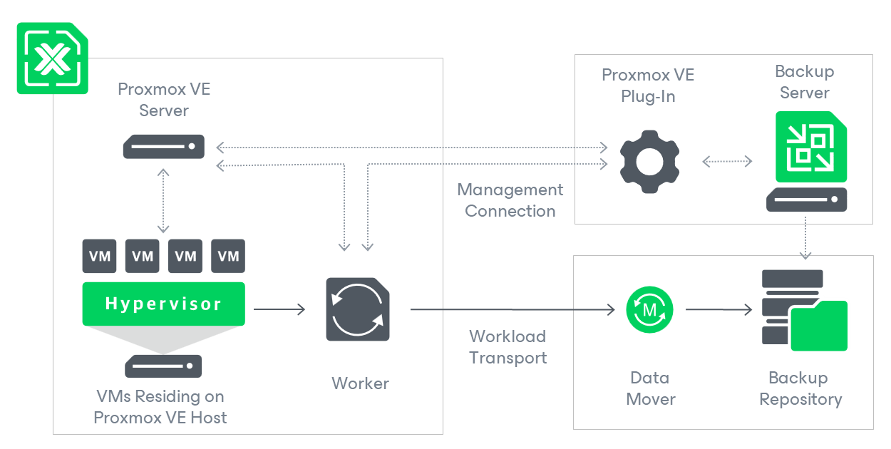

[back](./README.md)

# Veeam & Proxmox VE

- [Veeam \& Proxmox VE](#veeam--proxmox-ve)
  - [Solution Architecture](#solution-architecture)
  - [How VM Backup Works](#how-vm-backup-works)
  - [Ports](#ports)
    - [Workers](#workers)
    - [Backup Server](#backup-server)
- [Issues](#issues)

[Veeam B&R PVE Docs](https://helpcenter.veeam.com/docs/vbproxmoxve/userguide/overview.html?ver=1)

With Veeam Backup & Replication 12.2, official support for Proxmox VE has been added! Though, the account used with VBR and PVE must have `root` priveleges. With Veeam Backup for PVE you can perform the following operations: 

- Create backups of Proxmox VE VMs and store them in backup repositories.
- Create VeeamZIP backups of Proxmox VE VMs.
- Create several instances (copies) of the same backup data in different locations.
- Restore VMs from Proxmox VE VM backups to the Proxmox VE environment.
- Restore VMs from VMware ESXi and Microsoft Hyper-V to the Proxmox VE environment.
- Restore VMs from Nutanix AHV and oVirt KVM backups to the Proxmox VE environment.
- Restore VMs from Proxmox VE VM backups to Microsoft Azure, Amazon Web Services (AWS) and Google Cloud environments.
- Perform Instant Recovery of Proxmox VE VMs to Nutanix AHV, VMware vSphere and Microsoft Hyper-V environments.
- Restore application items (such as Microsoft Active Directory, Microsoft
Exchange, Microsoft SharePoint, Oracle Database and Microsoft SQL
Server).
- Restore files and folders of Proxmox VE VM guest OSes.
- Export disks of backed-up Proxmox VE VMs to VMDK, VHD and VHDX formats.
- Mount disks of backed-up Proxmox VE VMs to any server and access data in the read-only mode.

## Solution Architecture

VBR for PVE comprises of the following components: 

- Proxmox VE Server
  - Standalone or cluster, VE uses the server to access PVE resources such as storage, networks, & VM's when performing backup and restore operations
- Backup Server
  - Windows based physical or virtual machine on which Veeam Backup & Replication is installed to. 
- Proxmox VE Plugin
  - Architecture component that enables integration between the backup server and the Proxmox VE host. This plugin also allows the backup server to deploy and manage workers
- Backup Repositories
  - A backup repository is a storage location where Veeam Backup for Proxmox VE stores backups of protected Proxmox VE VMs.
  - To communicate with backup repositories, Veeam Backup for Proxmox VE uses Veeam Data Mover — the service that is responsible for data processing and transfer. By default, Veeam Data Mover runs on the repositories themselves. If a repository cannot host Veeam Data Mover, it starts on a gateway server — a dedicated component that “bridges” the backup server and workers. For more information, see the Veeam Backup & Replication User Guide, section Gateway Server.
- Workers
  - A worker is a Linux-based VM that resides on the Proxmox VE host and processes backup workloads when transferring data to and from backup repositories.
  - Recommended 1 per PVE host

## How VM Backup Works

Veeam Backup for Proxmox VE performs VM backup in the following way:

1. Launches a worker on the same host where the processed VM resides.

    - If no worker is deployed on the host, Veeam Backup for Proxmox VE launches a worker that is deployed on any other Proxmox VE host connected to the backup infrastructure.

1. Connects to the Proxmox VE server and creates an copy-on-write snapshot of the processed VM.
2. Reads data from VM disks, compares it to the data written to the created
snapshot, excludes the changes and transfers the resulting data to the
target repository — and stores it in the native Veeam format.

   - To reduce the amount of data read from VM disks, Veeam Backup for Proxmox VE uses the changed block tracking (CBT) mechanism: during incremental backup sessions, Veeam Backup for Proxmox VE
 compares the current disk content with the backed-up content and reads 
only those data blocks that have changed since the previous backup 
session. If CBT cannot be used, Veeam Backup for Proxmox VE reads all data from the VM disks. For more information, see [Changed Block Tracking](https://helpcenter.veeam.com/docs/vbproxmoxve/userguide/changed_block_tracking.html).

   - Veeam Backup for Proxmox VE compresses and deduplicates data saved to repositories.

1. Removes the created snapshot and suspends the worker when the backup session completes.

## Ports

Veeam Backup for Proxmox VE automatically creates firewall rules for the 
ports required to allow communication between the Proxmox VE server, 
workers and the backup server.

### Workers

The following table describes network ports that must be open to ensure 
proper communication of workers with other backup infrastructure 
components.

| From | To | Protocol | Port | Notes |
| --- | --- | --- | --- | --- |
| Worker | Proxmox VE server | TCP/HTTPS | 8006 | Used to communicate with the REST API service running on the Proxmox VE server. |
|  | Proxmox VE server | SSH | 22 | Used to communicate with Proxmox VE server. |
|  | Veeam backup repository or [gateway server](https://helpcenter.veeam.com/docs/backup/vsphere/gateway_server.html?ver=120) | TCP | 2500-3300 | Default
 range of ports used as transmission channels for jobs and restore 
sessions. For each TCP connection that a job uses, one port from this 
range is assigned. |
|  | Rocky Linux repositories
(mirrors.rockylinux.org, mirrors.fedoraproject.org) | TCP/HTTP(S) | 80 (443) | Used to get OS security updates and .NET Core package updates. |
|  | Veeam Update Repository
(repository.veeam.com, cloudfront.net) | TCP/HTTPS | 443 | Used to download worker deployment packages. |
|  | Nginx repository
(nginx.org/packages/, nginx.org/packages/keys/) | TCP/HTTPS | 443 | Used to download Nginx packages for worker updates. |

### Backup Server

The following table describes network ports that must be open to ensure 
proper communication of the backup server with other backup 
infrastructure components.

| From | To | Protocol | Port | Notes |
| --- | --- | --- | --- | --- |
| Veeam Backup & Replication console | Backup server | TCP/HTTPS | 8544 | Used to communicate with the Platform Service REST API.
 |
| Backup server | FLR helper appliance | TCP | 22 | Used to connect to the helper appliance during file-level restore. |
|  | Backup server | TCP/HTTPS | 6172 | Used by the Platform Service to enable communication with the Veeam Backup & Replication database. |
|  | Proxmox VE server | TCP/HTTPS | 8006 | Used to communicate with the REST API service running on the Proxmox VE server. |
|  | Proxmox VE server | SSH | 22 | Used to communicate with the Proxmox VE server. |

>**Note:**
>
>For the list of ports used by the backup server to communicate with backup >repositories, see the Veeam Backup & Replication User Guide, section [Used Ports]>(https://helpcenter.veeam.com/docs/backup/vsphere/used_ports.html?ver=120#backup-repositories).

# Issues

One one PVE instance, I've had minimal trouble with the Veeam Proxy required to backup PVE VM's. In my homelab, I had issues where the Veeam Proxy wouldn't acquire an IP address. I did no major changes, failed attempts at logging into the VM itself. It was originally set for a static address, which originally worked to add the Veeam Worker. However, upon it's first job run, it failed to acquire an IP address and the whole job failed. I retried the job with no success, reconfigured the worker for DCHP, which acquired an IP address during the test but again, failed on job execution. I gave up that night, came back ~24hrs later and reset the worker back to a static IP address, tests passed and the job was successful.

Backing up my NAS host (Heimdall) - originally when doing a 'full' backup of this host, since it serves as an iSCSI target, there are multiple LVM volumes under the name `ubuntu-vg/ubuntu-lv`, I couldn't rename the Heimdall's root LVM, even by it's uuid, I suspect the raid enforced by the server is the cause, but need to confirm that. To resolve the issue, I ended up migrating the ubuntu VM's that had the same LVM name as Heimdall to other storage locations. Only one actually existed, Plex's storage, the other was a left over from the removal of the PVE node Thor. 