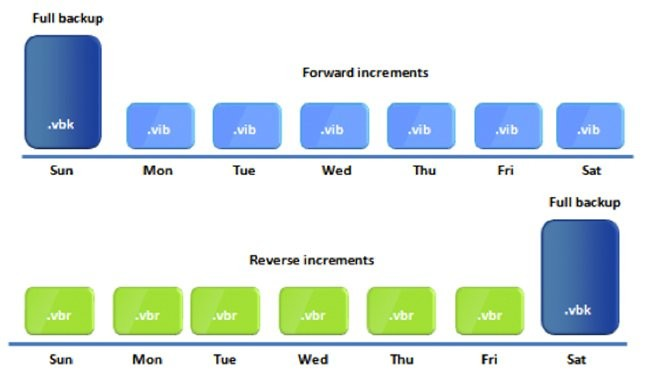
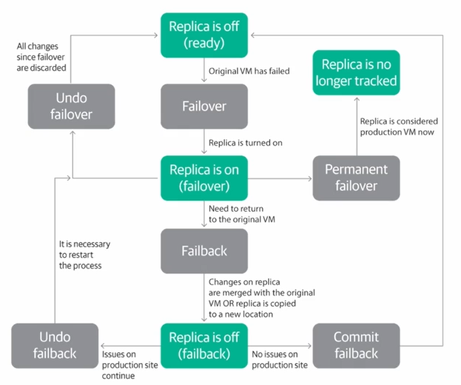

[back](./README.md)

# Veeam Certififed Engineer (VMCE)

Exam notes as I go through VMCE training course targeting Veeam Backup & Replication version 12. 

# 4 Key Components of Veeam Backup and Replication

- Backup Server
  - Installation point for Veeam backup and replication, VM or physical host, min 4vCPU and 8GB RAM.
- Proxy Server
  - Reads VM data from production storage (Dedupe, compression, encryption)
  - Transfers data from production storage to backup repository.
  - Transport Modes: Direct Storage Access, Virtual Appliance (HotAdd), Network
  - Can be physical or VM, if physical, 2 Proxies are recommended
- Repository Server
  - Storage location for backup files, VM Copies and metadata for replicated VM's
  - Recommended to be physical machines
  - Storage Types: DAS, NAS (NFS 3.0 or 4.1 recommended), SMB, Dedupe Storage Appliances, Object storage (S3)
    - NOTE: All types of storage except Direct Attached Storage (DAS) will require a Gateway Server to host the Veeam Data mover components. Gateway server are automatically selected, but will default to the VBR server if no other components are available. 
  - Hardened Repos: Linux Hardened Repos
    - Malware-Safe, Immutable (Requires: backup job: forward inc with synth or active periodic full backups. Backup Copy Job: GFS enabled Retention policy)
    - Non-Root single-use account - Temporary credentials to add to VBR server, uses certificate based auth after initial handshake. 
    - Offline Tape Storage (Veeam is almost best-in class for this)
    - Object storage: 
      - Immutability, single port communication, no API calls, multiple locations available (On-Prem, Cloud or multi-cloud)
        - ASW S3, Glacier S3, Snowball Edge
        - Azure Blob, Archive, Data Box
        - IBM Cloud
        - Wasabi S3
        - S3 Compatible: MinIO, Cloudian, ObjectFirst, BackBlaze etc...
- Database Server
  - Microsoft SQL Server (manual setup required) or PostgreSQL (PostgreSQL is preffered)

# The Golden Rule

3-2-1-1-0 rule is an industry recognized term that refers to best practices for data backup and recovery. It entails: 
- 3 different copies of backups
- 2 different media types
- 1 backup copy kept on site
- 1 backup copy kept off site
- 0 errors after backup recovery verification (SureBackup - unique to Veeam, for other software, refer to it's documentation or create your own recovery plan and test it regularly!)

Veeam SureBackup feature verifies the recoverability of backups by mounting them, running scripts and testing services and applications

## RPO & RTO
- RTO: Recovery Time Objective - The amount of time it takes to restore an application from the moment it goes down to the moment it is fully operational again. The maximum amount of time a business can tolerate being offline. 
  - RTO is only achieved when the application is functions as it did before the outage. 
- RPO: Recovery Point Objective - How much data loss is acceptable? This aligns with backup frequency, with a typical 24hr interval, resulting in a maximum of 24 hours of data loss.

## Forward vs Reverse Incremental Backups

Forward backups start with a full backup and each incremental backup only tracks the changes since the last full backup. 

Reverse backups will always show the full backup as the latest restore point. The incremental changes are historical in this case and are rolled up into the full backup. This is a legacy method of backups when Veeam was targeting small/medium businesses, it was easier and more desirable for customers to export the latest (full) backup to removeable media. With modern filesystems this makes next to zero sense to implement. 

> #### Quote from [Veeam Forums](https://forums.veeam.com/veeam-agent-for-windows-f33/forward-incremental-vs-reverse-incremental-t88990.html)
> Reversed incremental is where Veeam started over 15 years ago. Back then we focused on VSMB customers, and having the latest backup as full backup available as a self-contained file provided certain benefits to those types of customers (it allowed for simple scripted export of backup files to removable media, tape etc.)
>
>These days, reverse incremental makes no sense because Veeam can do virtually everything natively (all those use cases that benefitted from reverse incremental backup format). While this backup mode never really had technical benefits, only drawbacks (in terms of performance and I/O load). We plan to discontinue reverse incremental backup mode in future, so I recommend you avoid deploying at least your new jobs like that. This, the comparison is very simple: don't use it :D
>
>Please note that literally every backup software has a concept of "backup chains" due to relying on incremental backup paradigm. Most just "hide" this fact from you because they do not let you select different types of backup chains. Veeam had to do it because we started from reverse incremental, then added more classic forward incremental for larger customers, but could not immediately remove reverse incremental due to many customers still having use cases dependent on that.
>
>In fact, it was not before later Veeam version and especially the proliferation of modern backup storage (ReFS/XFS/object) when reverse incremental really started to sink dramatically in our customer base, because it really does not make ANY sense for such deployments.

## GFS Grandfather, Father, Son

Veeams terminology for keeping multiple backup copies, ie keeping 1 weekly, 1 monthly and 1 yearly, so you always have 3 full extra backups at earlier dates in time on top of your normal backups (full backup + incrementals) in short term storage. GFS is more typical for archival storage and plays a key role in a Retention Policy. 

Retention policy is influenced by the frequency of backups, the way the backups are categorized, the total number of backups (Jobs, GFS, retention points), the rate of change in data foreach machine with a backup job. This also heavily influences the amount of storage you will need and where you will be able to store all backups and their copies. 

# Replication

When enabling replication between clusters (VMWare), you will need a Veeam Proxy on both source and destination ends. One to send the data to the replicated site/cluser and another to recieve and process the data. If source and destination are on different networks/physical locations, you will need Veeam B&R on both ends and they musts be able to communicate with eachother (BGP, VPN, etc...). If using VSphere, then both remote and local VSphere servers must be added to Veeam B&R. 

You cannot store replication metadata in a Scale-Out Backup Repository, it must be in a normal repository. 

## Failover

Failover is a process of switching from the VM on the source host to its VM replica on a host in the disaster recovery site. Failback is a process of returning from the VM replica to the source VM.

Veeam B&R provides the following failover and failback operations: 

- Perform Failover
- Perform Planned Failover
- Create Failover Plan
- Perform permanent failover
- Undo failover
- Perform failback:  
When you perform failback, you shift all processes back to the source VM and send to the source VM all changes that took place while the VM replica was running. During failover, changes made on the source VM are not sent to the VM replica.  
If the source host is not available, you can recover a VM with the same configuration as the source VM and switch to it. For more information on how failback is performed, see Failback.  
When you perform failback, changes are only sent to the source/recovered VM but not published. You must test whether the source/recovered VM works with these changes. Depending on the test results, you can do the following:
  - Commit failback
  - Undo failback

