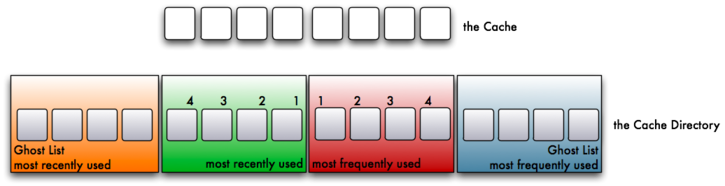
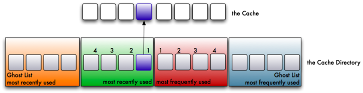
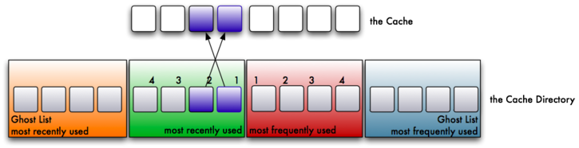
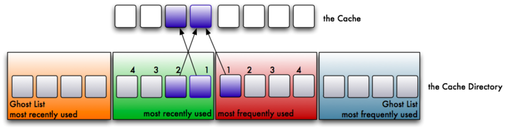
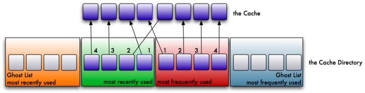
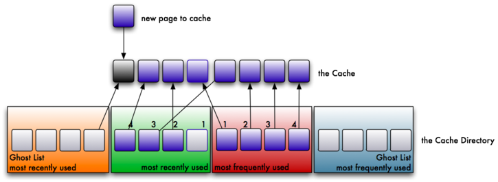
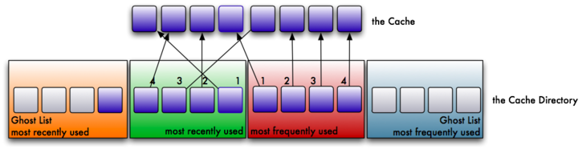
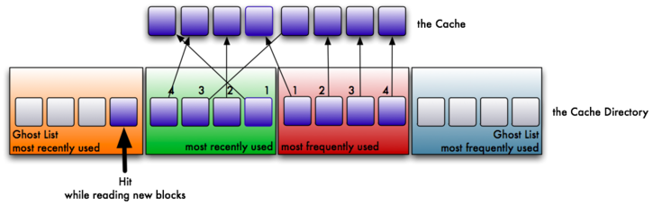
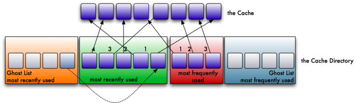

[back](./README.md)

# Adjustable Replacement Cache (ARC)

## Traditional Caches

Caching mechanisms on Linux and other operating systems use what is called a Least Recently Used caching algorithm. The way the LRU algorithm works, is when an application reads data blocks, they are put into the cache. The cache will fill as more and more data is read, and put into the cache. However, the cache is a FIFO (first in, first out) algorithm. Thus, when the cache is full, the older pages will be pushed out of the cache. Even if those older pages are accessed more frequently. Think of the whole process as a conveyor belt. Blocks are put into most recently used portion of the cache. As more blocks are read, the push the older blocks toward the least recently used portion of the cache, until they fall off the conveyor belt, or in other words are evicted.

Image showing the traditional LRU caching scheme as a conveyor belt- FIFO (first in, first out)
Image showing the traditional LRU caching scheme. Image courtesy of Storage Gaga.

When large sequential reads are read from disk, and placed into the cache, it has a tendency to evict more frequently requested pages from the cache. Even if this data was only needed once. Thus, from the cache perspective, it ends up with a lot of worthless, useless data that is no longer needed. Of course, it's eventually replaced as newer data blocks are requested.

There do also exist least frequently used (LFU) caches. However, they suffer from the problem that newer data could be evicted from the cache if it's not read frequently enough. Thus, there are a great amount of disk requests, which kind of defeats the purpose of a cache to begin with. So, it would seem that the obvious approach would be to somehow combine the two- have an LRU and an LFU simultaneously.

## The ZFS ARC

The ZFS adjustable replacement cache (ARC) is one such caching mechanism that caches both recent block requests as well as frequent block requests. It is an implementation of the patented IBM adaptive replacement cache, with some modifications and extensions.

Before beginning, I should mention that I learned a lot about the ZFS ARC from http://www.c0t0d0s0.org/archives/5329-Some-insight-into-the-read-cache-of-ZFS-or-The-ARC.html. The following images of that post I am reusing here. Thank you Joerg for an excellent post.

## Terminology

- Adjustable Replacement Cache, or ARC- A cache residing in physical RAM. It is built using two caches- the most frequently used cached and the most recently used cache. A cache directory indexes pointers to the caches, including pointers to disk called the ghost frequently used cache, and the ghost most recently used cache.
- Cache Directory- An indexed directory of pointers making up the MRU, MFU, ghost MRU and ghost MFU caches.
- MRU Cache- The most recently used cache of the ARC. The most recently requested blocks from the filesystem are cached here.
- MFU Cache- The most frequently used cache of the ARC. The most frequently requested blocks from the filesystem are cached here.
- Ghost MRU- Evicted pages from the MRU cache back to disk to save space in the MRU. Pointers still track the location of the evicted pages on disk.
- Ghost MFU- Evicted pages from the MFU cache back to disk to save space in the MFU. Pointers still track the location of the evicted pages on disk.
- Level 2 Adjustable Replacement Cache, or L2ARC- A cache residing outside of physical memory, typically on a fast SSD. It is a literal, physical extension of the RAM ARC.

## The ARC Algorithm

This is a simplified version of how the IBM ARC works, but it should help you understand how priority is placed both on the MRU and the MFU. First, let's assume that you have eight pages in your cache. Four pages in your cache will be used for the MRU and four pages for the MFU. Further, there will also be four pointers for the ghost MRU and four pointers for the ghost MFU. As such, the cache directory will reference 16 pages of live or evicted cache.



As would be expected, when block A is read from the filesystem, it will be cached in the MRU. An index pointer in the cache directory will reference the the MRU page.



Suppose now a different block (block B) is read from the filesystem. It too will be cached in the MRU, and an index pointer in the cache directory will reference the second MRU page. Because block B was read more recently than block A, it gets higher preference in the MRU cache than block A. There are now two pages in the MRU cache.



Now suppose block A is read again from the filesystem. This would be two reads for block A. As a result, it has been read frequently, so it will be store in the MFU. A block must be read at least twice to be stored here. Further, it is also a recent request. So, not only is the block cached in the MFU, it is also referenced in the MRU of the cache directory. As a result, although two pages reside in cache, there are three pointers in the cache directory pointing to two blocks in the cache.



Eventually, the cache is filled with the above steps, and we have pointers in the MRU and the MFU of the cache directory.



Here's where things get interesting. Suppose we now need to read a new block from the filesystem that is not cached. Because of the pigeon hole principle, we have more pages to cache than we can store. As such, we will need to evict a page from the cache. The oldest page in the MRU (referred to as the Least Recently Used- LRU) gets the eviction notice, and is referenced by the ghost MRU. A new page will now be available in the MRU for the newly read block.



After the newly read block is read from the filesystem, as expected, it is stored in the MRU and referenced accordingly. Thus, we have a ghost MRU page reference, and a filled cache.



Just to throw a monkey wrench into the whole process, let us suppose that the recently evicted page is re-read from the filesystem. Because the ghost MRU knows it was recently evicted from the cache, we refer to this as "a phantom cache hit". Because ZFS knows it was recently cached, we need to bring it back into the MRU cache; not the MFU cache, because it was not referenced by the MFU ghost.



Unfortunately, our cache is too small to store the page. So, we must grow the MRU by one page to store the new phantom hit. However, our cache is only so large, so we must adjust the size of the MFU by one to make space for the MRU. Of course, the algorithm works in a similar manner on the MFU and ghost MFU. Phantom hits for the ghost MFU will enlarge the MFU, and shrink the MRU to make room for the new page.



So, imagine two polar opposite work loads. The first work load reads lot of random data from disk, with very little duplication. The MRU will likely make up most of the cache, while the MFU will make up very little. The cache has adjusted itself for the load the system is under. Consider the second work load, however, that continuously reads the same data over and over, with very little newly read data. In this scenario, the MFU will likely make up most of the cache, while the MRU will not. As a result, the cache has been adjusted to represent the load the system is under.

Remember our traditional caching scheme mentioned earlier? The Linux kernel uses the LRU scheme to swap cached pages to disk. As such, it always favors recent cache hits over frequent cache hits. This can have drastic consequences if you need to read a large number of blocks only once. You will swap out frequently cached pages to disk, even if your newly read data is only needed once. Thus, you could end up with THE SWAP OF DEATH, as the frequently requested pages have to come back off of disk from the swap area. With the ARC, we modify the cache to adapt to the load (thus, the reason it's called the "Adaptive Read Cache").
ZFS ARC Extensions

The previous algorithm is a simplified version of the ARC algorithm as designed by IBM. There are some extensions that ZFS has made, which I'll mention here:

- The ZFS ARC will occupy 1/2 of available RAM. However, this isn't static. If you have 32 GB of RAM in your server, this doesn't mean the cache will always be 16 GB. Rather, the total cache will adjust its size based on kernel decisions. If the kernel needs more RAM for a scheduled process, the ZFS ARC will be adjusted to make room for whatever the kernel needs. However, if there is space that the ZFS ARC can occupy, it will take it up.
- The ZFS ARC can work with multiple block sizes, whereas the IBM implementation uses static block sizes.
- Pages can be locked in the MRU or MFU to prevent eviction. The IBM implementation does not have this feature. As a result, the ZFS ARC algorithm is a bit more complex in choosing when a page actually gets evicted from the cache.

## The L2ARC

The level 2 ARC, or L2ARC should be fast disk. As mentioned in my previous post about the ZIL, this should be DRAM DIMMs (not necessarily battery-backed), a fast SSD, or 10k+ enterprise SAS or FC disk. If you decide to use the same device for both your ZIL and your L2ARC, which is certainly acceptable, you should partition it such that the ZIL takes up very little space, like 512 MB or 1 GB, and give the rest to the pool as a striped (RAID-0) L2ARC. Persistence in the L2ARC is not needed, as the cache will be wiped on boot.

Image showing the triangular setup of data storage, with RAM occupying the top third of the triangle, the L2ARC and the ZIL occupying the middle third of the triangle, and pooled disk occupying the bottom third of the triangle.
Image courtesy of The Storage Architect

The L2ARC is an extension of the ARC in RAM, and the previous algorithm remains untouched when an L2ARC is present. This means that as the MRU or MFU grow, they don't both simultaneously share the ARC in RAM and the L2ARC on your SSD. This would have drastic performance impacts. Instead, when a page is about to be evicted, a walking algorithm will evict the MRU and MFU pages into an 8 MB buffer, which is later set as an atomic write transaction to the L2ARC. The obvious advantage here, is that the latency of evicting pages from the cache is not impacted. Further, if a large read of data blocks is sent to the cache, the blocks are evicted before the L2ARC walk, rather than sent to the L2ARC. This minimizes polluting the L2ARC with massive sequential reads. Filling the L2ARC can also be very slow, or very fast, depending on the access to your data.

## Adding an L2ARC

WARNING: Some motherboards will not present disks in a consistent manner to the Linux kernel across reboots. As such, a disk identified as /dev/sda on one boot might be /dev/sdb on the next. For the main pool where your data is stored, this is not a problem as ZFS can reconstruct the VDEVs based on the metadata geometry. For your L2ARC and SLOG devices, however, no such metadata exists. So, rather than adding them to the pool by their /dev/sd? names, you should use the /dev/disk/by-id/* names, as these are symbolic pointers to the ever-changing /dev/sd? files. If you don't heed this warning, your L2ARC device may not be added to your hybrid pool at all, and you will need to re-add it later. This could drastically affect the performance of the applications when pulling evicted pages off of disk.

You can add an L2ARC by using the "cache" VDEV. It is recommended that you stripe the L2ARC to maximize both size and speed. Persistent data is not necessary for an L2ARC, so it can be volatile DIMMs. Suppose I have 4 platter disks in my pool, and an OCZ Revodrive SSD that presents two 60 GB drives to the system. I'll partition the drives on the SSD, giving 4 GB to the ZIL and the rest to the L2ARC. This is how you would add the L2ARC to the pool. Here, I am using GNU parted to create the partitions first, then adding the SSDs. The devices in /dev/disk/by-id/ are pointing to /dev/sda and /dev/sdb. FYI.

```bash
# parted /dev/sda unit s mklabel gpt mkpart primary zfs 2048 4G mkpart primary zfs 4G 109418255
# parted /dev/sdb unit s mklabel gpt mkpart primary zfs 2048 4G mkpart primary zfs 4G 109418255
# zpool add tank cache \
/dev/disk/by-id/ata-OCZ-REVODRIVE_OCZ-33W9WE11E9X73Y41-part2 \
/dev/disk/by-id/ata-OCZ-REVODRIVE_OCZ-X5RG0EIY7MN7676K-part2 \
log mirror \
/dev/disk/by-id/ata-OCZ-REVODRIVE_OCZ-69ZO5475MT43KNTU-part1 \
/dev/disk/by-id/ata-OCZ-REVODRIVE_OCZ-9724MG8BII8G3255-part1
# zpool status tank
  pool: tank
 state: ONLINE
 scan: scrub repaired 0 in 1h8m with 0 errors on Sun Dec  2 01:08:26 2012
config:

        NAME                                              STATE     READ WRITE CKSUM
        tank                                              ONLINE       0     0     0
          raidz1-0                                        ONLINE       0     0     0
            sdd                                           ONLINE       0     0     0
            sde                                           ONLINE       0     0     0
            sdf                                           ONLINE       0     0     0
            sdg                                           ONLINE       0     0     0
        logs
          mirror-1                                        ONLINE       0     0     0
            ata-OCZ-REVODRIVE_OCZ-69ZO5475MT43KNTU-part1  ONLINE       0     0     0
            ata-OCZ-REVODRIVE_OCZ-9724MG8BII8G3255-part1  ONLINE       0     0     0
        cache
          ata-OCZ-REVODRIVE_OCZ-69ZO5475MT43KNTU-part2    ONLINE       0     0     0
          ata-OCZ-REVODRIVE_OCZ-9724MG8BII8G3255-part2    ONLINE       0     0     0

errors: No known data errors
```

Further, I can check the size of the L2ARC at any time:

```bash
#zpool iostat -v
                                                     capacity     operations    bandwidth
pool                                              alloc   free   read  write   read  write
------------------------------------------------  -----  -----  -----  -----  -----  -----
pool                                               824G  2.82T     11     60   862K  1.05M
  raidz1                                           824G  2.82T     11     52   862K   972K
    sdd                                               -      -      5     29   289K   329K
    sde                                               -      -      5     28   289K   327K
    sdf                                               -      -      5     29   289K   329K
    sdg                                               -      -      7     35   289K   326K
logs                                                  -      -      -      -      -      -
  mirror                                          1.38M  3.72G      0     19      0   277K
    ata-OCZ-REVODRIVE_OCZ-69ZO5475MT43KNTU-part1      -      -      0     19      0   277K
    ata-OCZ-REVODRIVE_OCZ-9724MG8BII8G3255-part1      -      -      0     19      0   277K
cache                                                 -      -      -      -      -      -
  ata-OCZ-REVODRIVE_OCZ-69ZO5475MT43KNTU-part2    2.34G  49.8G      0      0    739  4.32K
  ata-OCZ-REVODRIVE_OCZ-9724MG8BII8G3255-part2    2.23G  49.9G      0      0    801  4.11K
------------------------------------------------  -----  -----  -----  -----  -----  -----
```

In this case, I'm using about 5 GB of cached data in the L2ARC (remember, it's striped), with plenty of space to go. In fact, the above paste is from a live running system with 32 GB of DDR2 RAM which is currently hosting this blog. The L2ARC was modified and re-added one week ago. This shows you the pace at which I am filling up the L2ARC on my system. Your situation may be different, but this isn't surprising that it is taking this long. Ben Rockwood has a Perl script that can break down the ARC and L2ARC by MRU, MFU, and the ghosts, as well as other stats. Check it out at http://www.cuddletech.com/blog/pivot/entry.php?id=979 (I don't have any experience with that script).
Conclusion

The ZFS Adjustable Replacement Cache improves on the original Adaptive Read Cache by IBM, while remaining true to the IBM design. However, the ZFS ARC has massive gains over traditional LRU and LFU caches, as deployed by the Linux kernel and other operating systems. And, with the addition of an L2ARC on fast SSD or disk, we can retrieve large amounts of data quickly, while still allowing the host kernel to adjust the memory requirements as needed.