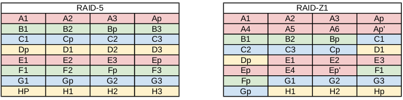

[back](./README.md)

# RAIDZ

## Standards Parity RAID

To understand RAIDZ, you first need to understand parity-based RAID levels, such as RAID-5 and RAID-6. Let's discuss the standard RAID-5 layout. You need a minimum of 3 disks for a proper RAID-5 array. On two disks, the data is striped. A parity bit is then calculated such than the XOR of all three stripes in the set is calculated to zero. The parity is then written to disk. This allows you to suffer one disk failure, and recalculate the data. Further, in RAID-5, no single disk in the array is dedicated for the parity data. Instead, the parity is distributed throughout all of the disks. Thus, any disk can fail, and the data can still be restored.

However, we have a problem. Suppose that you write the data out in the RAID-5 stripe, but a power outtage occurs before you can write the parity. You now have inconsistent data. Jeff Bonwick, the creator of ZFS, refers to this as a "RAID-5 write hole". In reality, it's a problem, no matter how small, for all parity-based RAID arrays. If there exists any possibility that you can write the data blocks without writing the parity bit, then we have the "write hole". What sucks, is the software-based RAID is not aware that a problem exists. Now, there are software work-arounds to identify that the parity is inconsistent with the data, but they're slow, and not reliable. As a result, software-based RAID has fallen out of favor with storage administrators. Rather, expensive (and failure-prone) hardware cards, with battery backups on the card, have become commonplace.

There is also a big performance problem to deal with. If the data being written to the stripe is smaller than the stripe size, then the data must be read on the rest of the stripe, and the parity recalculated. This causes you to read and write data that is not pertinent to the application. Rather than reading only live, running data, you spend a great deal of time reading "dead" or old data. So, as a result, expensive battery-backed NVRAM hardware RAID cards can hide this latency from the user, while the NVRAM buffer fills working on this stripe, until it's been flushed to disk.

In both cases, the RAID-5 write hole, and writing data to disk that is smaller than the stripe size, the atomic transactional nature of ZFS does not like the hardware solutions, as it's impossible, and does not like existing software solutions as it opens up the possibility of corrupted data. So, we need to rethink parity-based RAID.

## ZFS RAIDZ

Enter RAIDZ. Rather than the stripe width be statically set at creation, the stripe width is dynamic. Every block transactionally flushed to disk is its own stripe width. Every RAIDZ write is a full stripe write. Further, the parity bit is flushed with the stripe simultaneously, completely eliminating the RAID-5 write hole. So, in the event of a power failure, you either have the latest flush of data, or you don't. But, your disks will not be inconsistent.


Demonstrating the dynamic stripe size of RAIDZ

There's a catch however. With standardized parity-based RAID, the logic is as simple as "every disk XORs to zero". With dynamic variable stripe width, such as RAIDZ, this doesn't work. Instead, we must pull up the ZFS metadata to determine RAIDZ geometry on every read. If you're paying attention, you'll notice the impossibility of such if the filesystem and the RAID are separate products; your RAID card knows nothing of your filesystem, and vice-versa. This is what makes ZFS win.

Further, because ZFS knows about the underlying RAID, performance isn't an issue unless the disks are full. Reading filesystem metadata to construct the RAID stripe means only reading live, running data. There is no worry about reading "dead" data, or unallocated space. So, metadata traversal of the filesystem can actually be faster in many respects. You don't need expensive NVRAM to buffer your write, nor do you need it for battery backup in the event of RAID write hole. So, ZFS comes back to the old promise of a "Redundant Array of Inexpensive Disks". In fact, it's highly recommended that you use cheap SATA disk, rather than expensive fiber channel or SAS disks for ZFS.

## Self-healing RAID

This brings us to the single-largest reason why I've become such a ZFS fan. ZFS can detect silent errors, and fix them on the fly. Suppose for a moment that there is bad data on a disk in the array, for whatever reason. When the application requests the data, ZFS constructs the stripe as we just learned, and compares each block against a default checksum in the metadata, which is currently fletcher4. If the read stripe does not match the checksum, ZFS finds the corrupted block, it then reads the parity, and fixes it through combinatorial reconstruction. It then returns good data to the application. This is all accomplished in ZFS itself, without the help of special hardware. Another aspect of the RAIDZ levels is the fact that if the stripe is longer than the disks in the array, if there is a disk failure, not enough data with the parity can reconstruct the data. Thus, ZFS will mirror some of the data in the stripe to prevent this from happening.

Again, if your RAID and filesystem are separate products, they are not aware of each other, so detecting and fixing silent data errors is not possible. So, with that out of the way, let's build some RAIDZ pools. As with my previous post, I'll be using 5 USB thumb drives /dev/sde, /dev/sdf, /dev/sdg, /dev/sdh and /dev/sdi which are all 8 GB in size.

## RAIDZ-1

RAIDZ-1 is similar to RAID-5 in that there is a single parity bit distributed across all the disks in the array. The stripe width is variable, and could cover the exact width of disks in the array, fewer disks, or more disks, as evident in the image above. This still allows for one disk failure to maintain data. Two disk failures would result in data loss. A minimum of 3 disks should be used in a RAIDZ-1. The capacity of your storage will be the number of disks in your array times the storage of the smallest disk, minus one disk for parity storage (there is a caveat to zpool storage sizes I'll get to in another post). So in my example, I should have roughly 16 GB of usable disk.

To setup a zpool with RAIDZ-1, we use the "raidz1" VDEV, in this case using only 3 USB drives:

```bash
# zpool create tank raidz1 sde sdf sdg
# zpool status tank
  pool: pool
 state: ONLINE
 scan: none requested
config:

        NAME          STATE     READ WRITE CKSUM
        pool          ONLINE       0     0     0
          raidz1-0    ONLINE       0     0     0
            sde       ONLINE       0     0     0
            sdf       ONLINE       0     0     0
            sdg       ONLINE       0     0     0

errors: No known data errors
```

Cleanup before moving on, if following in your terminal:

`# zpool destroy tank`

## RAIDZ-2

RAIDZ-2 is similar to RAID-6 in that there is a dual parity bit distributed across all the disks in the array. The stripe width is variable, and could cover the exact width of disks in the array, fewer disks, or more disks, as evident in the image above. This still allows for two disk failures to maintain data. Three disk failures would result in data loss. A minimum of 4 disks should be used in a RAIDZ-2. The capacity of your storage will be the number of disks in your array times the storage of the smallest disk, minus two disks for parity storage. So in my example, I should have roughly 16 GB of usable disk.

To setup a zpool with RAIDZ-2, we use the "raidz2" VDEV:

```bash
# zpool create tank raidz2 sde sdf sdg sdh
# zpool status tank
  pool: pool
 state: ONLINE
 scan: none requested
config:

        NAME          STATE     READ WRITE CKSUM
        pool          ONLINE       0     0     0
          raidz2-0    ONLINE       0     0     0
            sde       ONLINE       0     0     0
            sdf       ONLINE       0     0     0
            sdg       ONLINE       0     0     0
            sdh       ONLINE       0     0     0

errors: No known data errors
```

Cleanup before moving on, if following in your terminal:

`# zpool destroy tank`

## RAIDZ-3

RAIDZ-3 does not have a standardized RAID level to compare it to. However, it is the logical continuation of RAIDZ-1 and RAIDZ-2 in that there is a triple parity bit distributed across all the disks in the array. The stripe width is variable, and could cover the exact width of disks in the array, fewer disks, or more disks, as evident in the image above. This still allows for three disk failures to maintain data. Four disk failures would result in data loss. A minimum of 5 disks should be used in a RAIDZ-3. The capacity of your storage will be the number of disks in your array times the storage of the smallest disk, minus three disks for parity storage. So in my example, I should have roughly 16 GB of usable disk.

To setup a zpool with RAIDZ-3, we use the "raidz3" VDEV:

```bash
# zpool create tank raidz3 sde sdf sdg sdh sdi
# zpool status tank
  pool: pool
 state: ONLINE
 scan: none requested
config:

        NAME          STATE     READ WRITE CKSUM
        pool          ONLINE       0     0     0
          raidz3-0    ONLINE       0     0     0
            sde       ONLINE       0     0     0
            sdf       ONLINE       0     0     0
            sdg       ONLINE       0     0     0
            sdh       ONLINE       0     0     0
            sdi       ONLINE       0     0     0

errors: No known data errors
```

Cleanup before moving on, if following in your terminal:

`# zpool destroy tank`

## Hybrid RAIDZ

Unfortunatly, parity-based RAID can be slow, especially when you have many disks in a single stripe (say a 48-disk JBOD). To speed things up a bit, it might not be a bad idea to chop up the single large RAIDZ VDEV into a stripe of multiple RAIDZ VDEVs. This will cost you usable disk space for storage, but can greatly increase performance. Of course, as with the previous RAIDZ VDEVs, the stripe width is variable within each nested RAIDZ VDEV. For each RAIDZ level, you can lose up to that many disks in each VDEV. So, if you have a stripe of three RAIDZ-1 VDEVs, then you can suffer a total of three disk failures, one disk per VDEV. Usable space would be calculated similarly. In this example, you would lose three disks due to parity storage in each VDEV.

To illustrate this concept, let's suppose we have a 12-disk storage server, and we want to lose as little disk as possible while maximizing performance of the stripe. So, we'll create 4 RAIDZ-1 VDEVs of 3 disks each. This will cost us 4 disks of usable storage, but it will also give us the ability to suffer 4 disk failures, and the stripe across the 4 VDEVs will increase performance.

To setup a zpool with 4 RAIDZ-1 VDEVs, we use the "raidz1" VDEV 4 times in our command. Notice that I've added emphasis on when to type "raidz1" in the command for clarity:

```bash
# zpool create tank raidz1 sde sdf sdg raidz1 sdh sdi sdj raidz1 sdk sdl sdm raidz1 sdn sdo sdp
# zpool status tank
  pool: pool
 state: ONLINE
 scan: none requested
config:

        NAME          STATE     READ WRITE CKSUM
        pool          ONLINE       0     0     0
          raidz1-0    ONLINE       0     0     0
            sde       ONLINE       0     0     0
            sdf       ONLINE       0     0     0
            sdg       ONLINE       0     0     0
          raidz1-1    ONLINE       0     0     0
            sdh       ONLINE       0     0     0
            sdi       ONLINE       0     0     0
            sdj       ONLINE       0     0     0
          raidz1-2    ONLINE       0     0     0
            sdk       ONLINE       0     0     0
            sdl       ONLINE       0     0     0
            sdm       ONLINE       0     0     0
          raidz1-3    ONLINE       0     0     0
            sdn       ONLINE       0     0     0
            sdo       ONLINE       0     0     0
            sdp       ONLINE       0     0     0

errors: No known data errors
```

Notice now that there are four RAIDZ-1 VDEVs. As mentioned in a previous post, ZFS stripes across VDEVs. So, this setup is essentially a RAIDZ-1+0. Each RAIDZ-1 VDEV will receive 1/4 of the data sent to the pool, then each striped piece will be further striped across the disks in each VDEV. Nested VDEVs can be a great way to keep performance alive and well, long after the pool has been massively fragmented.

Cleanup before moving on, if following in your terminal:

`# zpool destroy tank`

## Some final thoughts on RAIDZ

Various recommendations exist on when to use RAIDZ-1/2/3 and when not to. Some people say that a RAIDZ-1 and RAIDZ-3 should use an odd number of disks. RAIDZ-1 should start with 3 and not exceed 7 disks in the array, while RAIDZ-3 should start at 7 and not exceed 15. RAIDZ-2 should use an even number of disks, starting with 6 disks and not exceeding 12. This is to ensure that you have an even number of disks the data is actually being written to, and to maximize performance on the array.

~~Instead, in my opinion, you should keep your RAIDZ array at a low power of 2 plus parity. For RAIDZ-1, this is 3, 5 and 9 disks. For RAIDZ-2, this is 4, 6, 10, and 18 disks. For RAIDZ-3, this is 5, 7, 11, and 19 disks.~~ If going north of these recommendations, I would use RAID-1+0 setups personally. This is largely due to the time it will take to rebuild the data (called "resilvering"- a post coming in a bit). Because calculating the parity bit is so expensive, the more disks in the RAIDZ arary, the more expensive this operation will be, as compared to RAID-1+0.

UPDATE: I no longer recommend the "power of 2 plus parity" setup. It's mostly a myth. See http://blog.delphix.com/matt/2014/06/06/zfs-stripe-width/ for a good argument as to why.

Further, I've seen recommendations on the sizes that the disks should be, saying not to exceed 1 TB per disk for RAIDZ-1, 2 TB per disk for RAIDZ-2 and 3 TB per disk for RAIDZ-3. For sizes exceeding these values, you should use 2-way or 3-way mirrors with striping. Whether or not there is any validity to these claims, I cannot say. But, I can tell you that with the fewer number of disks, you should use a RAID level that accomadates your shortcomings. In a 4-disk RAID array, as I have above, calculating multiple parity bits can kill performance. Further, I could suffer at most two disk failures (if using RAID-1+0 or RAIDZ-2). RAIDZ-1 meets somewhere in the middle, where I can suffer a disk failure while stil maintaining a decent level of performance. If I had say 12 disks in the array, then maybe a RAIDZ-1+0 or RAIDZ-3 would be better suited, as the chances of suffering multiple disk failures increases.

Ultimately, you need to understand your storage problem and benchmark your disks. Put them in various RAID configurations, and use a utility such as IOZone 3 to benchmark and stress the array. You know what data you are going to store on the disk. You know what sort of hardware the disks are being installed into. You know what sort of performance you are looking for. It's your decision, and if you spend your time doing research, homework and sleuthing, you will arrive at the right decision. There may be "best practices", but they only go as far as your specific situation.

Lastly, in terms of performance, mirrors will always outperform RAIDZ levels. On both reads and writes. Further, RAIDZ-1 will outperform RAIDZ-2, which it turn will outperform RAIDZ-3. The more parity bits you have to calculate, the longer it's going to take to both read and write the data. Of course, you can always add striping to your VDEVs to maximize on some of this performance. Nested RAID levels, such as RAID-1+0 are considered "the Cadillac of RAID levels" due to the flexibility in which you can lose disks without parity, and the throughput you get from the stripe. So, in a nutshell, from fastest to slowest, your non-nested RAID levels will perform as:

    RAID-0 (fastest)
    RAID-1
    RAIDZ-1
    RAIDZ-2
    RAIDZ-3 (slowest)

