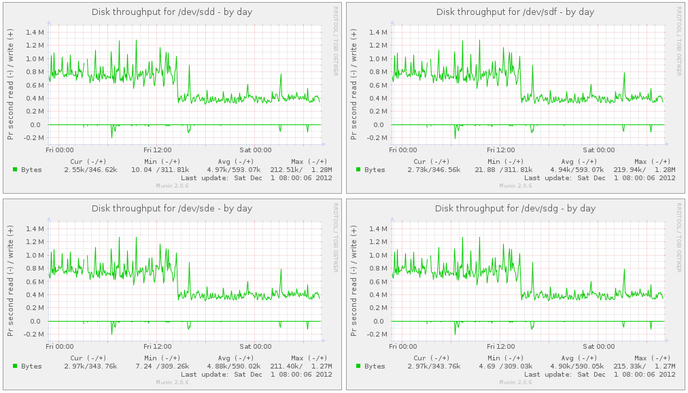
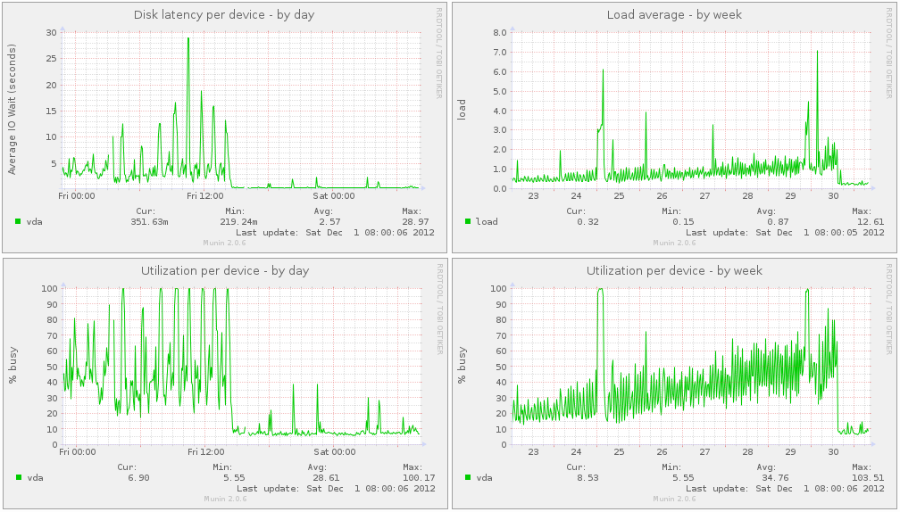

# ZFS Intent Log (ZIL)

## Terminology

Before we can begin, we need to get a few terms out of the way that seem to be confusing people on forums, blog posts, mailing lists, and general discussion. It confused me, even though I understood the end goal, right up to the writing of this post. So, let's get at it:

- ZFS Intent Log, or ZIL- A logging mechanism where all of the data to be the written is stored, then later flushed as a transactional write. Similar in function to a journal for journaled filesystems, like ext3 or ext4. Typically stored on platter disk. Consists of a ZIL header, which points to a list of records, ZIL blocks and a ZIL trailer. The ZIL behaves differently for different writes. For writes smaller than 64KB (by default), the ZIL stores the write data. For writes larger, the write is not stored in the ZIL, and the ZIL maintains pointers to the synched data that is stored in the log record.
- Separate Intent Log, or SLOG- A separate logging device that caches the synchronous parts of the ZIL before flushing them to slower disk. This would either be a battery-backed DRAM drive or a fast SSD. The SLOG only caches synchronous data, and does not cache asynchronous data. Asynchronous data will flush directly to spinning disk. Further, blocks are written a block-at-a-time, rather than as simultaneous transactions to the SLOG. If the SLOG exists, the ZIL will be moved to it rather than residing on platter disk. Everything in the SLOG will always be in system memory.

When you read online about people referring to "adding an SSD ZIL to the pool", they are meaning adding an SSD SLOG, of where the ZIL will reside. The ZIL is a subset of the SLOG in this case. The SLOG is the device, the ZIL is data on the device. Further, not all applications take advantage of the ZIL. Applications such as databases (MySQL, PostgreSQL, Oracle), NFS and iSCSI targets do use the ZIL. Typical copying of data around the filesystem will not use it. Lastly, the ZIL is generally never read, except at boot to see if there is a missing transaction. The ZIL is basically "write-only", and is very write-intensive.

## SLOG Devices

Which device is best for a SLOG? In order from fastest to slowest, here's my opinion:

- NVRAM- A battery-backed DRAM drive, such as the ZeusRAM SSD by STEC. Fastest and most reliable of this list. Also most expensive.
- SSDs- NAND flash-based chips with wear-leveling algorithms. Something like the PCI-Express OCZ SSDs or Intel. Preferably should be SLC, although the gap between SLC and MLC SSDs is thinning.
- 10k+ SAS drives- Enterprise grade, spinning platter disks. SAS and fiber channel drives push IOPS over throughput, typically twice as fast as consumer-grade SATA. Slowest and least reliable of this list. Also the cheapest.

It's important to identify that all three devices listed above can maintain data persistence during a power outage. The SLOG and the ZIL are critical in getting your data to spinning platter. If a power outage occurs, and you have a volatile SLOG, the worst thing that will happen is the new data is not flushed, and you are left with old data. However, it's important to note, that in the case of a power outage, you won't have corrupted data, just lost data. Your data will still be consistent on disk.

## SLOG Performance

Because the SLOG is fast disk, what sort of performance can I expect to see out of my application or system? Well, you will see improved disk latencies, disk utilization and system load. What you won't see is improved throughput. Remember that the SLOG device is still flushing data to platter every 5 seconds. As a result, benchmarking disk after adding a SLOG device doesn't make much sense, unless the goal of the benchmark is to test synchronous disk write latencies. So, I don't have those numbers for you to gravel over. What I do have, however, are a few graphs.

I have a virtual machine that is disk-write intensive. It is a disk image on a GlusterFS replicated filesystem on a ZFS dataset. I have plenty of RAM in the hypervisor, a speedy CPU, but slow SATA disk. Due to the applications on this virtual machine wanting to write many graphs to disks frequently, with the graphs growing, I was seeing ~5-10 second disk latencies. The throughput on the disk was intense. As a result, doing any writes in the VM was painful. System upgrades, modifying configuration files, even logging in. It was all very, very slow.

So, I partitioned my SSDs, and added the SLOG. Immediately, my disk latencies dropped to around 200 milliseconds. Disk utilization dropped from around 50% busy to around 5% busy. System load dropped from 1-2 to almost non-existent. Everything concerning the disks is in a much more healthy state, and the VM is much more happy. As proof, look at the following graphs preserved here from http://zen.ae7.st/munin/.

This first image shows my disks from the hypervisor perspective. Notice that the throughput for each device was around 800 KBps. After adding the SSD SLOG, the throughput dropped to 400 KBps. This means that the underlying disks in the pool are doing less work, and as a result, will last longer.


Image showing all 4 disks throughput in the zpool on the hypervisor.

This next image show my disk from the virtual machine perspective. Notice how disk latency and utilization drop as explained above, including system load.


Image showing what sort of load the virtual machine was under.

I blogged about this just a few days ago at http://pthree.org/2012/12/03/how-a-zil-improves-disk-latencies/.

## Adding a SLOG

**WARNING**: Some motherboards will not present disks in a consistent manner to the Linux kernel across reboots. As such, a disk identified as /dev/sda on one boot might be /dev/sdb on the next. For the main pool where your data is stored, this is not a problem as ZFS can reconstruct the VDEVs based on the metadata geometry. For your L2ARC and SLOG devices, however, no such metadata exists. So, rather than adding them to the pool by their /dev/sd? names, you should use the /dev/disk/by-id/* names, as these are symbolic pointers to the ever-changing /dev/sd? files. If you don't heed this warning, your SLOG device may not be added to your hybrid pool at all, and you will need to re-add it later. This could drastically affect the performance of the applications depending on the existence of a fast SLOG.

Adding a SLOG to your existing zpool is not difficult. However, it is considered best practice to mirror the SLOG. So, I'll follow best practice in this example. Suppose I have 4 platter disks in my pool, and an OCZ Revodrive SSD that presents two 60 GB drives to the system. I'll partition the drives on the SSD, for 5 GB, then mirror the partitions as my SLOG. This is how you would add the SLOG to the pool. Here, I am using GNU parted to create the partitions first, then adding the SSDs. The devices in /dev/disk/by-id/ are pointing to /dev/sda and /dev/sdb. FYI.

```bash
# parted /dev/sda mklabel gpt mkpart primary zfs 0 5G
# parted /dev/sdb mklabel gpt mkpart primary zfs 0 5G
# zpool add tank log mirror \
/dev/disk/by-id/ata-OCZ-REVODRIVE_OCZ-69ZO5475MT43KNTU-part1 \
/dev/disk/by-id/ata-OCZ-REVODRIVE_OCZ-9724MG8BII8G3255-part1
# zpool status
  pool: tank
 state: ONLINE
 scan: scrub repaired 0 in 1h8m with 0 errors on Sun Dec  2 01:08:26 2012
config:

        NAME                                              STATE     READ WRITE CKSUM
        pool                                              ONLINE       0     0     0
          raidz1-0                                        ONLINE       0     0     0
            sdd                                           ONLINE       0     0     0
            sde                                           ONLINE       0     0     0
            sdf                                           ONLINE       0     0     0
            sdg                                           ONLINE       0     0     0
        logs
          mirror-1                                        ONLINE       0     0     0
            ata-OCZ-REVODRIVE_OCZ-69ZO5475MT43KNTU-part1  ONLINE       0     0     0
            ata-OCZ-REVODRIVE_OCZ-9724MG8BII8G3255-part1  ONLINE       0     0     0
```

## SLOG Life Expectancy

Because you will likely be using a consumer-grade SSD for your SLOG in your GNU/Linux server, we need to make some mention of the wear and tear of SSDs for write-intensive scenarios. Of course, this will largely vary based on manufacturer, but we can setup some generalities.

First and foremost, ZFS has advanced wear-leveling algorithms that will evenly wear each chip on the SSD. There is no need for TRIM support, which in all reality, is really just a garbage collection support more than anything. The wear-leveling of ZFS in inherent due to the copy-on-write nature of the filesystem.

Second, various drives will be implemented with different nanometer processes. The smaller the nanometer process, the shorter the life of your SSD. As an example, the Intel 320 is a 25 nanometer MLC 300 GB SSD, and is rated at roughly 5000 P/E cycles. This means you can write to your entire SSD 5000 times if using wear leveling algorithms. This produces 1500000 GB of total written data, or 1500 TB. My ZIL maintains about 3 MB of data per second. As a result, I can maintain about 95 TB of written data per year. This gives me a life of about 15 years for this Intel SSD.

However, the Intel 335 is a 20 nanometer MLC 240 GB SSD, and is rated at roughly 3000 P/E cycles. With wear leveling, this means you can write you entire SSD 3000 times, which produces 720 TB of total written data. This is only 7 years for my 3 MBps ZIL, which is less than 1/2 the life expectancy the Intel 320. Point is, you need to keep an eye on these things when planning out your pool.

Now, if you are using a battery-backed DRAM drive, then wear leveling is not a problem, and the DIMMs will likely last the duration of your server. Same might be said for 10k+ SAS or FC drives.

## Capacity

Just a short note to say that you will likely not need a large ZIL. I've partitioned my ZIL with only 4 GB of usable space, and it's barely occupying a MB or two of space. I've put all my virtual machines on the same hypervisor, ran operating system upgrades, while they were also doing a great amount of work, and only saw the ZIL get up to about 100 MB of cached data. I can't imagine what sort of workload you would need to get your ZIL north of 1 GB of used space, let alone the 4 GB I partitioned off. Here's a command you can run to check the size of your ZIL:

```bash
# zpool iostat -v tank
                                                     capacity     operations    bandwidth
tank                                              alloc   free   read  write   read  write
------------------------------------------------  -----  -----  -----  -----  -----  -----
tank                                               839G  2.81T     76      0  1.86M      0
  raidz1                                           839G  2.81T     73      0  1.81M      0
    sdd                                               -      -     52      0   623K      0
    sde                                               -      -     47      0   620K      0
    sdf                                               -      -     50      0   623K      0
    sdg                                               -      -     47      0   620K      0
logs                                                  -      -      -      -      -      -
  mirror                                          1.46M  3.72G     20      0   285K      0
    ata-OCZ-REVODRIVE_OCZ-69ZO5475MT43KNTU-part1      -      -     20      0   285K      0
    ata-OCZ-REVODRIVE_OCZ-9724MG8BII8G3255-part1      -      -     20      0   285K      0
------------------------------------------------  -----  -----  -----  -----  -----  -----
```

## Conclusion

A fast SLOG can provide amazing benefits for applications that need lower latencies on synchronous transactions. This works well for database servers or other applications that are more time sensitive. However, there is increased cost for adding a SLOG to your pool. The battery-backed DRAM chips are very, very expensive. Usually on the order of $2,500 per 8 GB of DDR3 DIMMs, where a 40 GB MLC SSD can cost you only $100, and a 600 GB 15k SAS drive is $200. Again though, capacity really isn't an issue, while performance is. I would go for faster IOPS on the SSD, and a smaller capacity. Unless you want to partition it, and share the L2ARC on the same drive, which is a great idea, and something I'll cover in the next post.